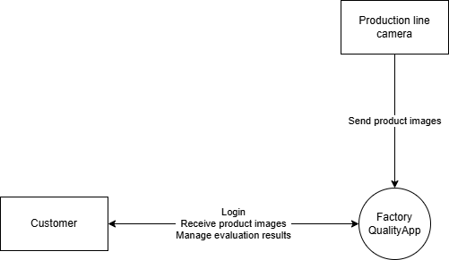
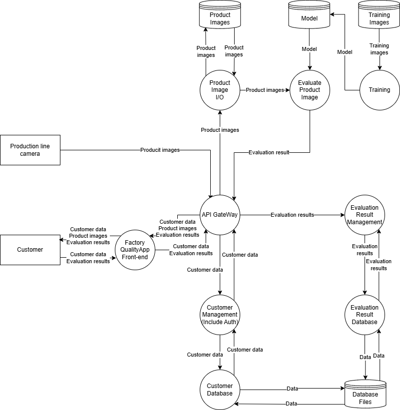
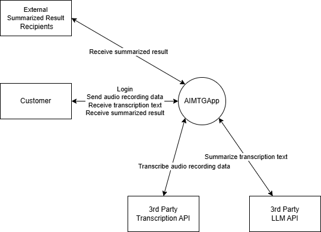
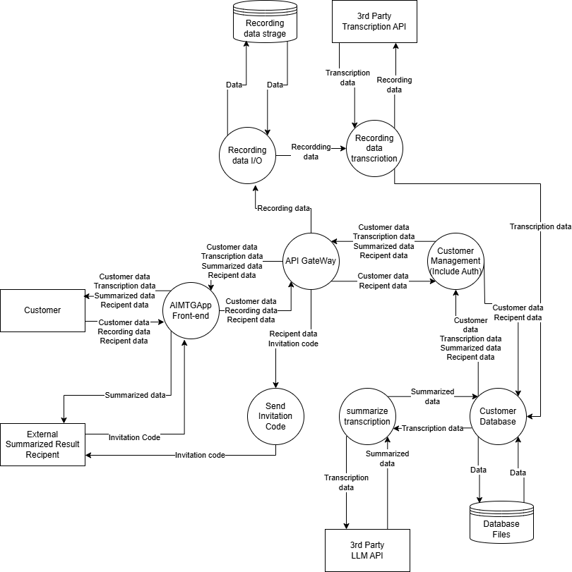
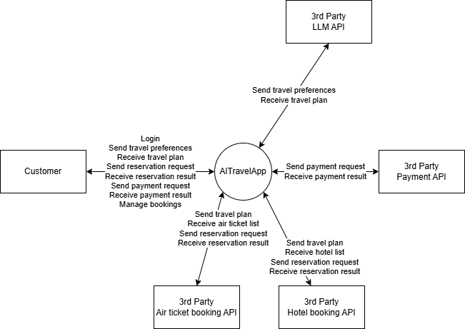
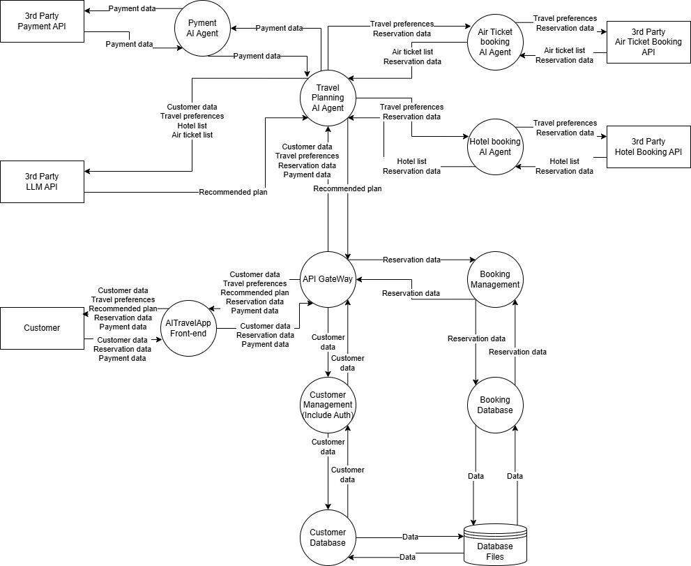

# Target Threat Models
The threat models in this study cover three types of applications, each using AI in a different way: applications with built-in AI functionality, applications using an external LLM, and applications using agentic AI. For the purpose of explanation, we set up fictitious company and application names, and prepared an overview, a context diagram, a data flow diagram, and a description of the data for each.

## Application with Built-in AI Functionality
As an application with built-in AI functionality, we assumed a factory quality inspection application with image recognition capabilities.
### Overview
FactoryQuality Inc. is a university-launched startup with expertise in image recognition. FactoryQuality Inc. is developing FactoryQualityApp, which uses image recognition to judge quality from cameras installed on factory work lines and allows the results to be checked through a web browser. FactoryQualityApp has the following functions.
* Judging the quality of products coming down the work line.
* Checking the judgment results in a web browser.

FactoryQualityApp's image recognition model is built in-house, and all of the servers are installed inside the factory.

### Context Diagram

### Data Flow Diagram

### Data Details
The details of the main data used in this application are as follows.

| Name | Description |
| ---- | ---- |
| Customer data | Login information, user name |
| Product images | Images of products |
| Evaluation results | Recognition results |
| Training images | Images for training |
| Model | Recognition model |

## Application Using an External LLM
As an application using an external LLM, we assumed a web application that uses an external LLM for transcription and summarization.

### Overview
AIMTGApp Inc. is a startup company. It is developing AIMTGApp, which allows meetings to be transcribed and summarized using a PC or a smartphone. AIMTGApp has the following main functions.
* Transcription of recorded meetings.
* Summarization of the transcription results.
* External sharing of the summarization results.

AIMTGApp realizes these functions by integrating with third-party APIs (transcription and LLM).

### Context Diagram

### Data Flow Diagram

### Data Details
The details of the main data used in this application are as follows.

| Name | Description |
| ---- | ---- |
| Customer data | Login information, user name |
| Transcription data | Transcription data |
| Summarized data | Summary data |
| Recipient data | Name of the sharing recipient, ID of the summary data to be shared |
| Recording data | Recording data |
| Invitation code | Invitation code |

## Application Using Agentic AI
As an application using agentic AI, we assumed an application for a domestic travel agency that provides customers with air tickets, hotels, rental cars, and travel experiences.

### Overview
AI Travel Service Inc. is a travel agency for domestic travel in Japan that provides customers with air tickets, hotels, rental cars, and travel experiences. It is developing AITravelApp, an interactive AI assistant that uses multiple agents such as a hotel reservation agent, an air ticket reservation agent, and a travel planning agent. AITravelApp has the following main functions.
* Drawing up travel plans based on preferences.
* Booking air tickets, hotels, and other services.
* Managing travel itineraries.

Through its various agents, AITravelApp integrates with third-party APIs (airlines, hotels, etc.) and with payment services and the like.

### Context Diagram

### Data Flow Diagram

### Data Details
The details of the main data used in this application are as follows.

| Name | Description |
| ---- | ---- |
| Customer data | Login information, user name, address, etc. |
| Travel preferences | Travel preferences |
| Recommended plan | Recommended hotels, air tickets, etc. |
| Reservation data | Dates and areas to be booked, booked hotels, booked air tickets, etc. |
| Payment data | Credit card information, etc. |
| Hotel list | Hotel names, addresses, rates, etc. |
| Air ticket list | Air tickets, fares, etc. |
