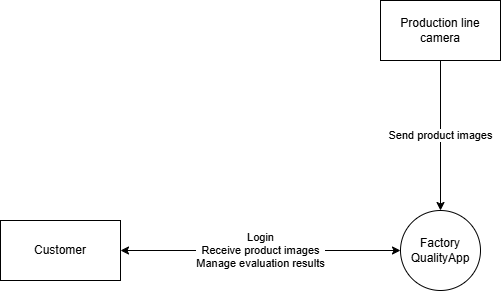
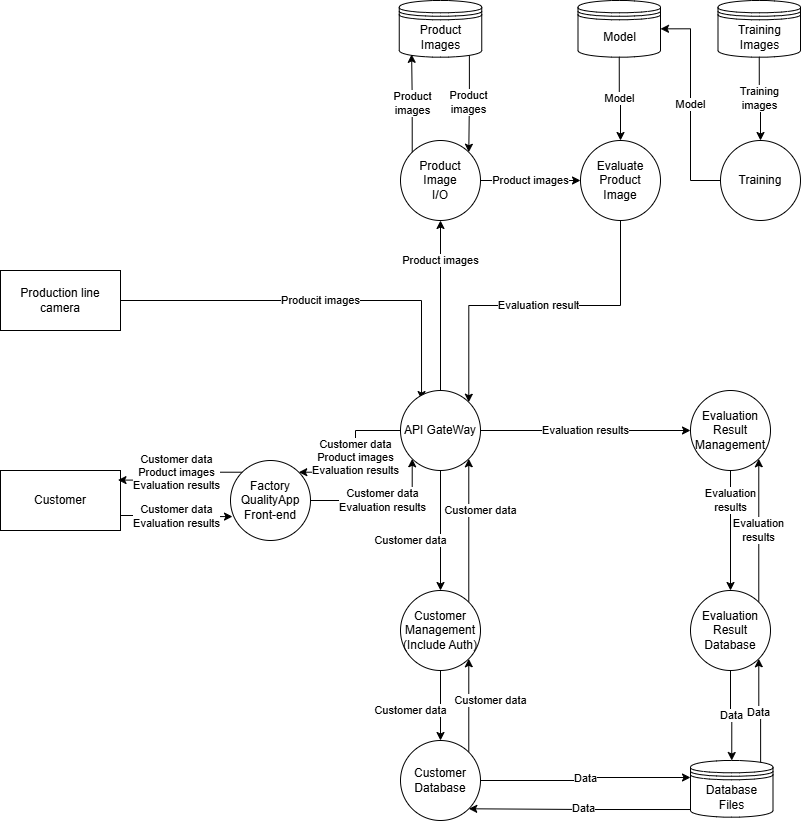
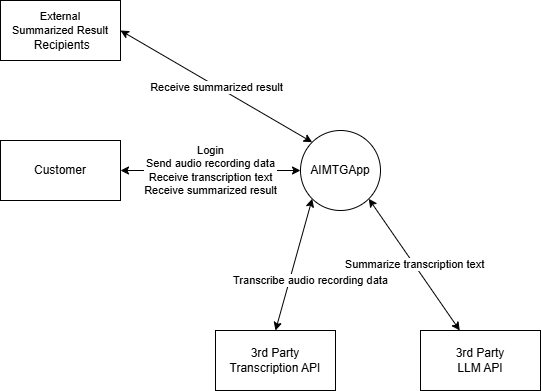
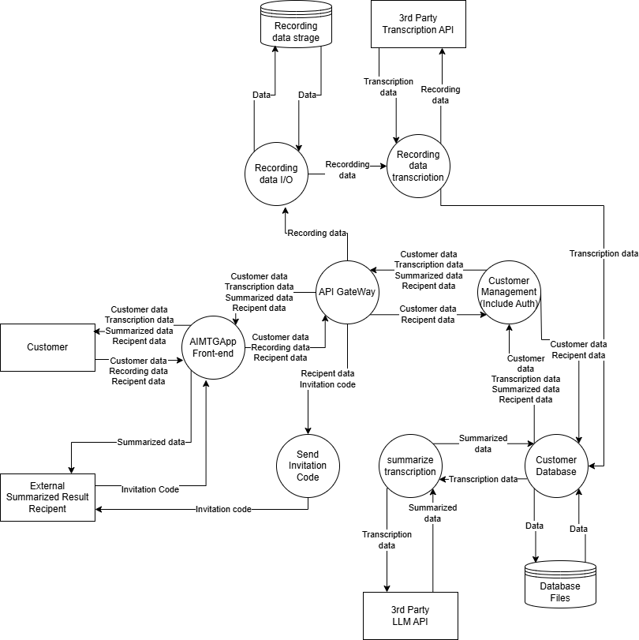
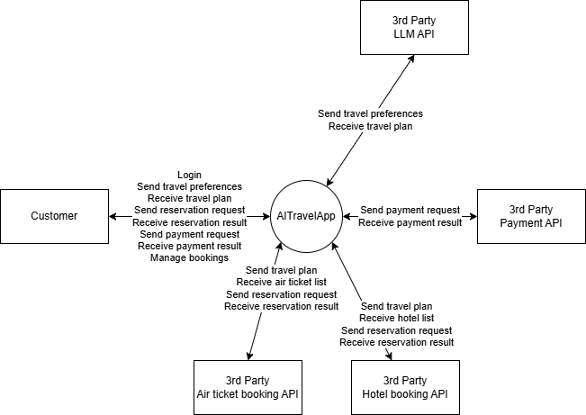
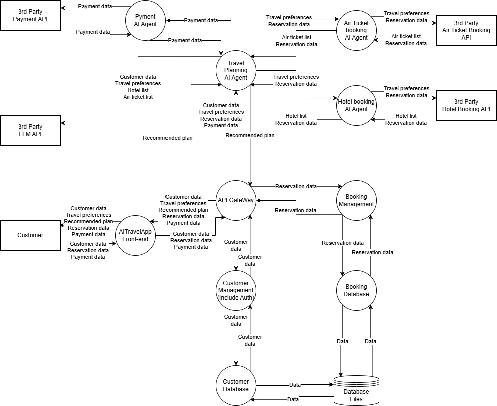

# 対象とする脅威モデル
今回対象とする脅威モデルは、それぞれAIの活用方法の異なる内部にAI機能を有するアプリケーション、外部のLLMを用いたアプリケーション及びエージェント型AIを用いたアプリケーションを対象としています。また、説明として架空の会社名やアプリケーション名を設定しそれらの概要、コンテキストダイアグラム、データフローダイアグラム及びデータに関する説明を用意しました。

## 内部にAI機能を有するアプリケーション
AI機能を内部に有するアプリケーションについては、画像認識機能を有する工場の品質検査アプリケーションを対象としました。
### 概要
FactoryQuality株式会社は画像認識の知見を持つ大学発ベンチャー企業です。FactoryQuality株式会社は、工場の作業レーンに設置したカメラから画像認識を用いて品質を判断し、Webブラウザ経由で結果を確認できるFactoryQualityAppを開発しています。FactoryQualityAppは下記の機能を有します。
* 作業レーンを流れてくる製品の品質を判断。
* 判断結果をWebブラウザ上で確認。

FactoryQualityAppは、画像認識のモデルを自社で構築しており、すべてのサーバ類は工場内に設置されています。

### コンテキストダイアグラム

### データフローダイアグラム

### データ詳細
本アプリケーションで用いられる主なデータの詳細は下記の通りです。

| 名称 | 概要 |
| ---- | ---- |
| Customer data | ログイン情報、ユーザ名 |
| Product images | 製品画像 |
| Evaluation results | 認識結果 |
| Training images | 訓練画像 |
| Model | 認識モデル |

## 外部のLLMを用いたアプリケーション
外部のLLMを用いたアプリケーションについては、文字起こしと要約に外部LLMを用いたWebアプリケーションを対象としました。

### 概要
AIMTGApp株式会社はスタートアップ企業であり、PCもしくはスマートフォンを用いて、会議の文字起こしから要約を行えるAIMTGAppを開発しています。AIMTGAppは主に下記の機能を有しています。
* 録音した会議の文字起こし。
* 文字起こし結果に対する要約。
* 要約結果の外部共有。

AIMTGAppは、第三者のAPI(文字起こし、LLM)と連携しこれらの機能を実現しています。

### コンテキストダイアグラム

### データフローダイアグラム

### データ詳細
本アプリケーションで用いられる主なデータの詳細は下記の通りです。

| 名称 | 概要 |
| ---- | ---- |
| Customer data | ログイン情報、ユーザ名 |
| Transcription data | 文字起こしデータ |
| Summarized data | 要約データ |
| Recipent data | 共有先名、共有する要約データID |
| Recording data | 録音データ |
| Invitation code | 招待コード |

## エージェント型AIを用いたアプリケーション
エージェント型AIを用いたアプリケーションについては、顧客に航空券、ホテル、レンタカー、旅行体験を提供する国内旅行代理店用のアプリケーションを対象としました。

### 概要
AI旅行サービス株式会社は、顧客に航空券、ホテルを提供する日本国内旅行代理店である。ホテル予約エージェント、航空券予約エージェント、旅行計画立案エージェントなどの複数のエージェントを用いた対話型AIアシスタントであるAITravelAppを開発中ですAITravelAppは主に下記の機能を有しています。
* 好みに基づいた旅行計画の立案。
* 航空券、ホテル、その他のサービスの予約。
* 旅行日程の管理。

AITravelAppは、各種エージェントを通じて第三者のAPI（航空会社、ホテル等）や決済サービス等と連携しています。

### コンテキストダイアグラム

### データフローダイアグラム

### データ詳細
本アプリケーションで用いられる主なデータの詳細は下記の通りです。

| 名称 | 概要 |
| ---- | ---- |
| Customer data | ログイン情報、ユーザ名、住所など |
| Travel preferences | 旅行の好み |
| Recommended plan | 推薦されたホテル、航空券など |
| Reservation data | 予約する日程・エリア、予約したホテル、予約した航空券など |
| Payment data | クレジットカード情報など |
| Hotel list | ホテル名、住所、料金など |
| Air ticket list | 航空券、料金など |