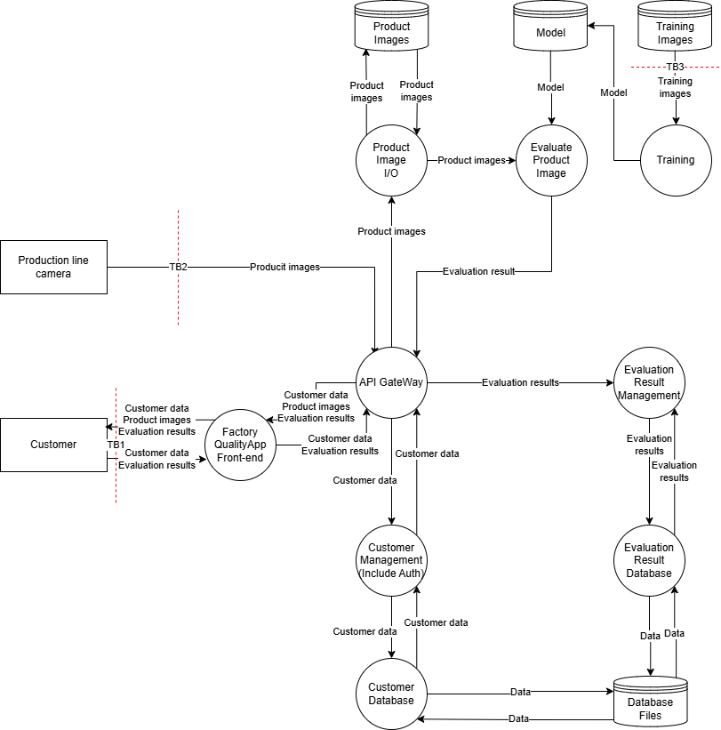
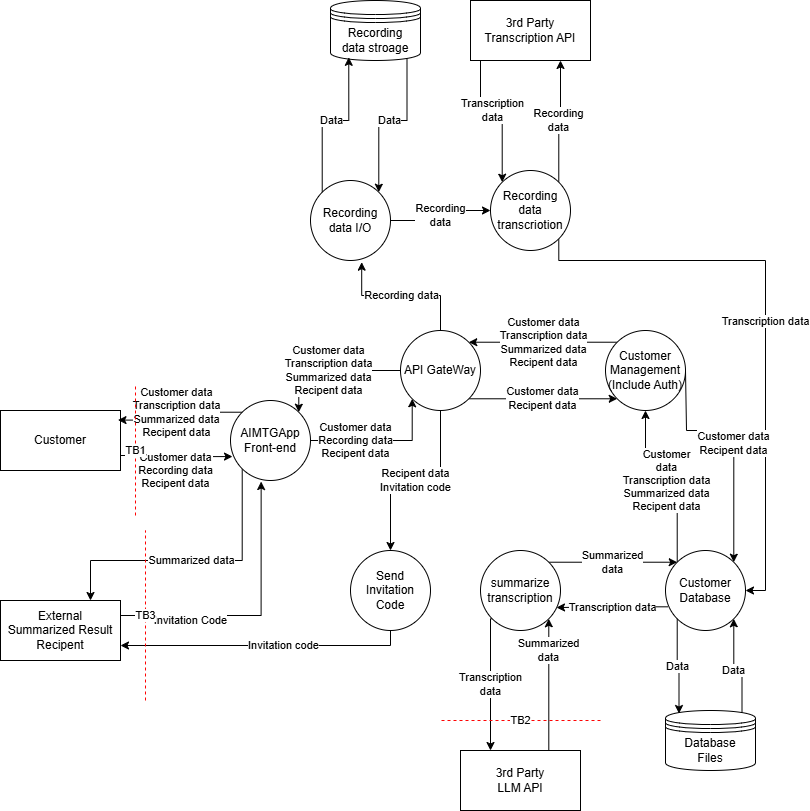
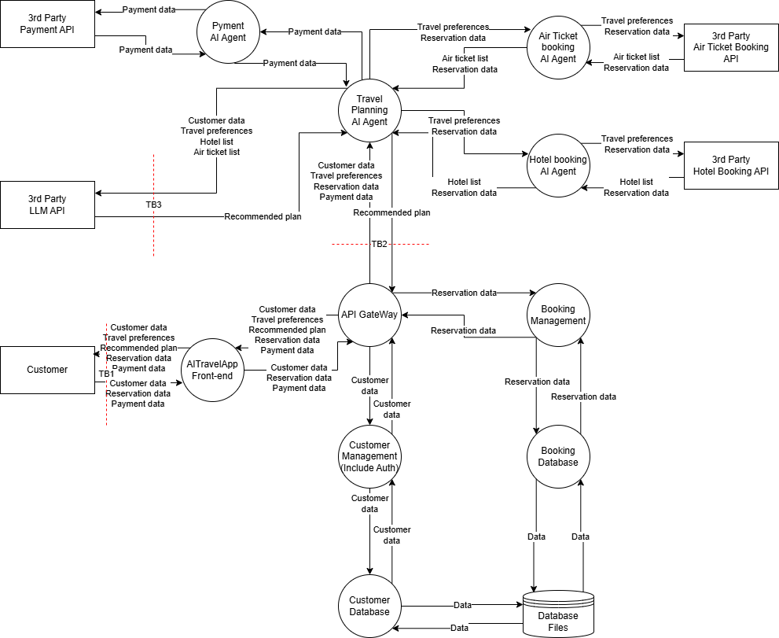

# STRIDE+AI
## 内部にAI機能を有するアプリケーション
### 信頼境界

### STRIDEテーブル
#### TB1
| | 緩和策 | 脆弱性 |
| ---- | ---- | ---- |
| S | ID/パスワード認証 | 多要素認証がない |
| T | TLS, 入力値検証 | |
| R | | ログ機能がない |
| I | | |
| D | | レートリミットがない |
| E | 権限制御 | |

#### TB2
| | 緩和策 | 脆弱性 |
| ---- | ---- | ---- |
| S | トークン認証 | |
| T | TLS, 入力値検証 | |
| R | | ログ機能がない |
| I | | データが暗号化されずに保存されている |
| D | | レートリミットがない |
| E | 権限制御 | |

#### TB3
| | 緩和策 | 脆弱性 |
| ---- | ---- | ---- |
| S | | データポイゾニング |
| T | | 敵対的攻撃に対する耐性がない |
| R | | |
| I | | |
| D | | |
| E | | |

### リスクの評価と脅威
| ID | 脆弱性 | 悪用可能性 | 普及度 | 検知可能性 | 技術的影響 | スコア | リスク | 対策 |
| ---- | ---- | ---- | ---- | ---- | ---- | ---- | ---- | ---- |
| V1 | カスタマーに多要素認証がない | 2 | 3 | 3 | 2 | 5.3 | MID | カスタマーに多要素認証を追加する |
| V2 | アプリに監査ログがない | 1 | 2 | 2 | 1 | 1.7 | LOW | アプリに監査ログを追加する |
| V3 | アプリにレートリミットがない | 2 | 3 | 3 | 2 | 5.3 | MID | アプリにレートリミットを追加する |
| V4 | カメラに送信した画像のログがない | 1 | 2 | 2 | 1 | 1.7 | LOW | カメラに送信ログを追加する |
| V5 | カメラに画像が暗号化されずに保存されている | 2 | 2 | 2 | 3 | 6 | MID | 画像を暗号化して保存する, 画像の保管期間を定める |
| V6 | トレーニングデータが汚染される恐れがある | 2 | 2 | 2 | 3 | 6 | MID | 利用するトレーニングデータを信用されたもののみにする |
| V7 | 敵対的攻撃に対する耐性がない | 2 | 2 | 2 | 3 | 6 | MID | 画像に対してフィルタリング等の処理を追加する |

LOW: <3, MID: 4<=6, HIGH: 7<=9

## 外部のLLMを用いたアプリケーション
### 信頼境界

### STRIDEテーブル
#### TB1
| | 緩和策 | 脆弱性 |
| ---- | ---- | ---- |
| S | ID/パスワード認証 | 多要素認証がない |
| T | TLS, 入力値検証 | |
| R | | ログ機能がない |
| I | | |
| D | | レートリミットがない |
| E | 権限制御 | |

#### TB2
| | 緩和策 | 脆弱性 |
| ---- | ---- | ---- |
| S | トークン認証 | |
| T | TLS, 入力値検証 | 要約結果に対するバイアス |
| R | ログ機能 | |
| I | 出力値検証 | システムプロンプトの漏洩 |
| D | レートリミット | |
| E | 権限制御 | 外部サイトへのリクエストの送信等の想定していない動作が行われる |

#### TB3
| | 緩和策 | 脆弱性 |
| ---- | ---- | ---- |
| S | | 招待コードが推測される恐れ |
| T | TLS | |
| R | | ログ機能がない |
| I | | 招待されてない第三者が要約内容を閲覧できる恐れ |
| D | | レートリミットがない |
| E | | |

### リスクの評価と脅威
| ID | 脆弱性 | 悪用可能性 | 普及度 | 検知可能性 | 技術的影響 | スコア | リスク | 対策 |
| ---- | ---- | ---- | ---- | ---- | ---- | ---- | ---- | ---- |
| V1 | カスタマーに多要素認証がない | 2 | 3 | 3 | 2 | 5.3 | MID | カスタマーに多要素認証を追加する |
| V2 | アプリに監査ログがない | 1 | 2 | 2 | 1 | 1.7 | LOW | アプリに監査ログを追加する |
| V3 | アプリにレートリミットがない | 2 | 3 | 3 | 2 | 5.3 | MID | アプリにレートリミットを追加する |
| V4 | 録音データに対する機密情報のバリデーションがない | 1 | 2 | 2 | 1 | 1.7 | LOW | 機密情報の取り扱いに関する同意を取得する, 外部APIによるデータ処理に問題がないことを確認する |
| V5 | 要約APIに出力値検証がない | 2 | 2 | 2 | 2 | 4 | MID | 要約APIに出力値検証を追加する |
| V6 | 招待コードが推測される恐れがある | 3 | 3 | 3 | 3 | 9 | HIGH | 招待コード方式をやめ、ログイン後のユーザのみが閲覧できるように修正する |
| V7 | 要約データに対するバイアス | 2 | 2 | 2 | 2 | 4 | MID | プロンプトインジェクション対策のフィルタリングを追加する |
| V8 | システムプロンプトの漏洩 | 2 | 2 | 2 | 3 | 6 | MID | プロンプトインジェクション対策のフィルタリングを追加する |
| V9 | 外部サイトへのリクエストの送信等の想定していない動作が行われる | 2 | 2 | 2 | 3 | 6 | MID | LLM API側で不要な機能を制限する |

LOW: <3, MID: 4<=6, HIGH: 7<=9

## エージェント型AIを用いたアプリケーション
### 信頼境界

### STRIDEテーブル
#### TB1
| | 緩和策 | 脆弱性 |
| ---- | ---- | ---- |
| S | ID/パスワード認証 | 多要素認証がない |
| T | TLS, 入力値検証 | |
| R | | ログ機能がない |
| I | | |
| D | | レートリミットがない |
| E | 権限制御 | |

#### TB2
| | 緩和策 | 脆弱性 |
| ---- | ---- | ---- |
| S | トークン認証 | |
| T | TLS, 入力値検証 | 結果に対するバイアス |
| R | | ログ機能がない |
| I | 出力値検証 | システムプロンプトの漏洩 |
| D | | レートリミットがない |
| E | 権限制御 | 外部サイトへのリクエストの送信等の想定していない動作が行われる |

#### TB3
| | 緩和策 | 脆弱性 |
| ---- | ---- | ---- |
| S | トークン認証 | |
| T | TLS, 入力値検証 | 結果に対するバイアス |
| R | ログ機能 | |
| I | 出力値検証 | システムプロンプトの漏洩 |
| D | レートリミット | |
| E | 権限制御 | 外部サイトへのリクエストの送信等の想定していない動作が行われる |

### リスクの評価と脅威
| ID | 脆弱性 | 悪用可能性 | 普及度 | 検知可能性 | 技術的影響 | スコア | リスク | 対策 |
| ---- | ---- | ---- | ---- | ---- | ---- | ---- | ---- | ---- |
| V1 | カスタマーに多要素認証がない | 2 | 3 | 3 | 2 | 5.3 | MID | カスタマーに多要素認証を追加する |
| V2 | アプリに監査ログがない | 1 | 2 | 2 | 1 | 1.7 | LOW | アプリに監査ログを追加する |
| V3 | アプリにレートリミットがない | 2 | 3 | 3 | 2 | 5.3 | MID | アプリにレートリミットを追加する |
| V4 | AI Agentとのやり取りのログがない | 1 | 2 | 2 | 1 | 1.7 | LOW | AI Agentのやり取りのログを追加する |
| V5 | AI Agentのレートリミットがない | 2 | 3 | 3 | 2 | 5.3 | MID | AI Agentにレートリミットを追加する |
| V6 | AI Agentの結果に対するバイアス | 2 | 2 | 2 | 2 | 4 | MID | プロンプトインジェクション対策のフィルタリングを追加する |
| V7 | AI Agentのシステムプロンプトの漏洩 | 2 | 2 | 2 | 3 | 6 | MID | プロンプトインジェクション対策のフィルタリングを追加する |
| V8 | AI Agentにおいて外部サイトへのリクエストの送信等の想定していない動作が行われる | 2 | 2 | 2 | 3 | 6 | MID | AI Agent側で不要な機能を制限する |
| V9 | LLM APIの出力値検証がない | 2 | 2 | 2 | 3 | 6 | MID | LLM APIに出力値検証を追加する |
| V10 | LLM APIの結果に対するバイアス | 2 | 2 | 2 | 2 | 4 | MID | プロンプトインジェクション対策のフィルタリングを追加する |
| V11 | LLM APIのシステムプロンプトの漏洩 | 2 | 2 | 2 | 3 | 6 | MID | プロンプトインジェクション対策のフィルタリングを追加する |
| V12 | LLM APIにおいて外部サイトへのリクエストの送信等の想定していない動作が行われる | 2 | 2 | 2 | 3 | 6 | MID | LLM API側で不要な機能を制限する |

LOW: <3, MID: 4<=6, HIGH: 7<=9