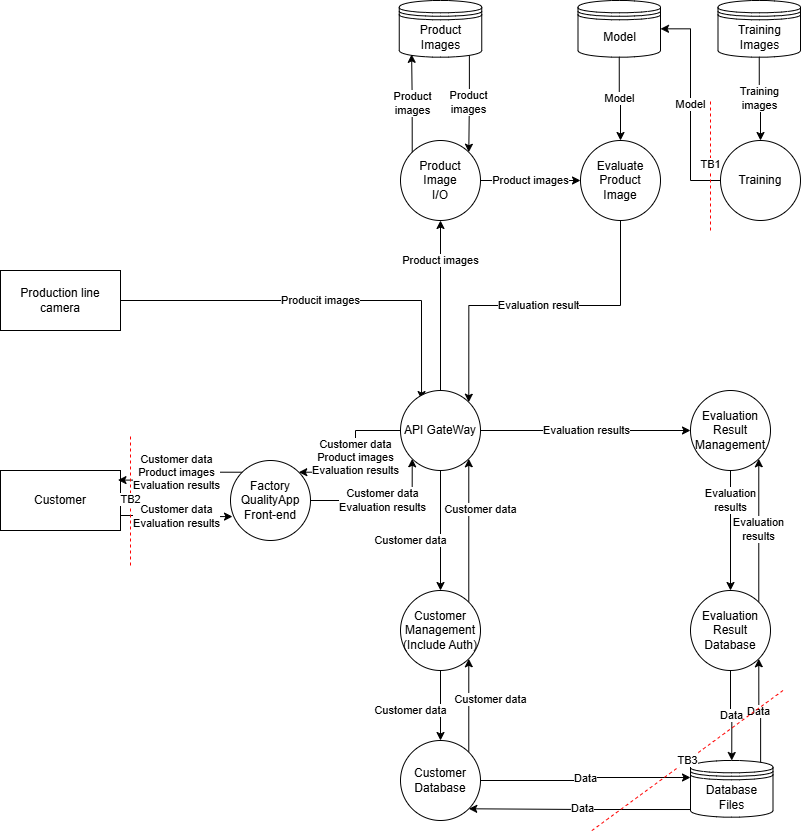
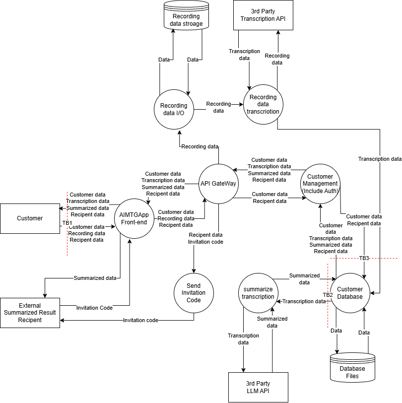
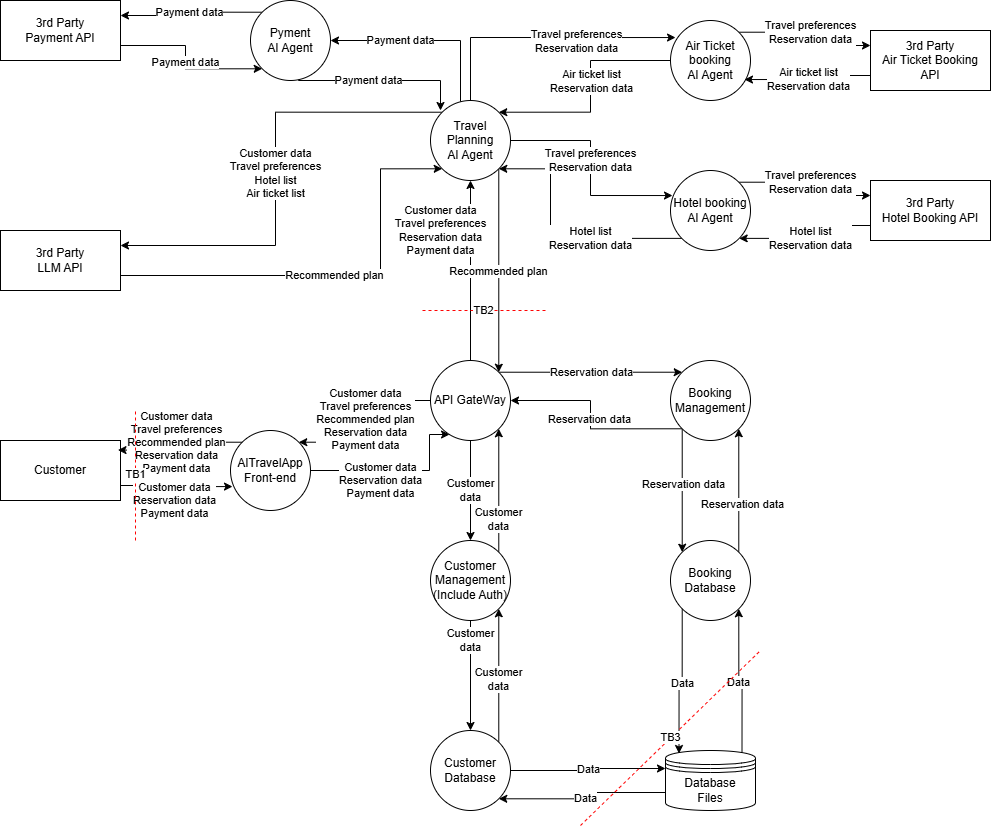

# STRIDE+AI
## Application with Built-in AI Functionality
### Trust Boundaries

### STRIDE Table
#### TB1
| TB1 | Mitigation | Vulnerability |
| --- | --- | --- |
|S|Service authentication for training jobs/CI + authentication of data submitters, verification of the authenticity of the data supply source|An unauthorized trainer/CI can impersonate a legitimate job and register a model. + An attacker impersonates the data supply source and mixes in malicious data.|
|T|Signature verification at registration/use time using the model signature, encryption of the communication path + digital signature verification of the training data|Files are tampered with during network transfer or while held in storage. + The training data itself is poisoned, causing degradation of the AI's recognition accuracy and unintended behavior.|
|R|Audit logs for model registration/update, assignment of correlation IDs + retention of the history of training data and parameters|The audit trail for model updates is thin, so at incident time it is impossible to trace "who updated it" / the action is repudiated + it is impossible to identify "which data and settings the model was trained with," so the cause of anomalous AI behavior cannot be investigated.|
|I|Least privilege for the model repository, encryption of the communication path + access restrictions via the inference API and protection of the model weight data|The model can be obtained illicitly (leakage of intellectual property, a foothold for model extraction) + the responses of the publicly exposed API and the like are analyzed, and confidential information about the AI's internal structure and training data is inferred and extracted.|
|D|Job queue for training/registration, rate limiting, resource caps + size limits on training processing and an upper limit on the cloud budget|The model update process can be stopped, for example by issuing a large number of jobs + deliberately huge data or complex processing is submitted, exhausting the computational resources and budget for machine learning.|
|E|Separation of privileges among the training environment, the model repository, and the inference environment + role-based access control in each of the training, registration, and inference phases|If the training environment is compromised, an attacker can move laterally as far as the model repository/inference side and tamper with them with high privileges + the privileges of the training environment are abused to break into the model repository, and a malicious model is deployed to the production environment.|

#### TB2
| TB2 | Mitigation | Vulnerability |
| --- | --- | --- |
|S|Introduction of MFA, strengthening of the password policy, introduction of account lockout and session management functions|An attacker can impersonate a customer and log in (credential theft/brute force). Session fixation and token theft succeed.|
|T|Encryption of communication data, appropriate parameter validation + hardening (robustification) of the model against adversarial examples, preprocessing of input images|Request parameters are tampered with in transit or via the browser, and tampering with the ID used to view results or an unauthorized request succeeds. + Adversarial examples (adversarial input) can induce misjudgment and evade the quality inspection.|
|R|Audit logs (critical operations such as viewing/downloading/searching/sharing), assignment of correlation IDs + retention of inference logs that link the input image data, the judgment result, and the version of the model applied|It cannot be traced who viewed/downloaded results and when, and the actor can repudiate the operation. + It cannot be traced which input/which model produced the judgment, so "misjudgment by the AI" is repudiated / becomes untraceable.|
|I|Masking of screens/logs, cache control, access control (object level), suppression of error messages, DLP + minimization of the judgment results returned to the API and screens (such as hiding confidence scores), rate limiting of the API|Recognition results and product images leak due to insufficient privileges or through the screen cache/logs. Other users' results can be viewed via IDOR and the like. + The results of continuous external queries to the API are analyzed, and the AI's training data and model structure are inferred and extracted (model extraction attack).|
|D|Rate limiting, introduction of a WAF, an upper limit on upload size + limits on the number of inference executions, monitoring of the computational resources for inference (GPUs, etc.) and cost alerts|A large volume of access or the upload of huge images overloads the front end/API, making it impossible to view results. + Images and the like that deliberately impose a high AI processing load are sent, exhausting the back end's inference resources (Sponge DoS / high-cost DoS).|
|E|Access privilege control, authorization control, separation of the administration screen, CSP/clickjacking countermeasures, XSS countermeasures|Through XSS or inadequate privilege checks, a general user can perform administrator-equivalent operations or access other users' assets.|

#### TB3
| TB3 | Mitigation | Vulnerability |
| --- | --- | --- |
|S|Service-to-service authentication, IAM-based DB connections, network access restrictions|An attacker can impersonate an internal service and connect to the DB (lack of service-to-service authentication / shared accounts)|
|T|Minimization of DB privileges, integrity constraints on critical tables, tamper detection + storage of judgment logs in append-only storage and hash verification|Judgment results and customer data are illicitly rewritten or deleted. + The accumulated judgment results are covertly tampered with, poisoning the data for future AI retraining or obstructing detection of degradation in the AI's performance.|
|R|DB audit logs, assignment of correlation IDs|Reads/updates cannot be traced, and data operations are repudiated|
|I|Encryption of stored data and the communication path, data masking + minimization of the retention period for judgment results, disposal of unnecessary past logs|Customer information and past quality judgment data are illicitly read from the database. + A large volume of accumulated judgment results (input-output pairs) leaks and is abused as a training dataset for replicating the company's own AI model.|
|D|Appropriate query timeout settings, access rate limiting|A large number of connections or high-load queries exhaust DB resources, stopping the functions for registering and viewing results|
|E|Access privilege control, authorization control|Through seizure of DB administrator privileges or misconfiguration, a general service can perform administrator-equivalent operations|

### Risk Assessment and Threats
| ID | Vulnerability | Ease of Exploit | Awareness | Intrusion Detection | Technical Impact | Score | Risk | Mitigation |
| --- | --- | --- | --- | --- | --- | --- | --- | --- |
|V1|An unauthorized trainer/CI can impersonate a legitimate job and register a model. + An attacker impersonates the data supply source and mixes in malicious data.|2|2|3|3|7|HIGH|Service authentication for training jobs/CI + authentication of data submitters, verification of the authenticity of the data supply source|
|V2|Files are tampered with during network transfer or while held in storage. + The training data itself is poisoned, causing degradation of the AI's recognition accuracy and unintended behavior.|2|2|2|3|6|MID|Signature verification at registration/use time using the model signature, encryption of the communication path + digital signature verification of the training data|
|V3|The audit trail for model updates is thin, so at incident time it is impossible to trace "who updated it" / the action is repudiated + it is impossible to identify "which data and settings the model was trained with," so the cause of anomalous AI behavior cannot be investigated.|1|2|2|2|3.3|MID|Audit logs for model registration/update, assignment of correlation IDs + retention of the history of training data and parameters|
|V4|The model can be obtained illicitly (leakage of intellectual property, a foothold for model extraction) + the responses of the publicly exposed API and the like are analyzed, and confidential information about the AI's internal structure and training data is inferred and extracted.|2|2|2|2|4|MID|Least privilege for the model repository, encryption of the communication path + access restrictions via the inference API and protection of the model weight data|
|V5|The model update process can be stopped, for example by issuing a large number of jobs + deliberately huge data or complex processing is submitted, exhausting the computational resources and budget for machine learning.|2|2|2|2|4|MID|Job queue for training/registration, rate limiting, resource caps + size limits on training processing and an upper limit on the cloud budget|
|V6|If the training environment is compromised, an attacker can move laterally as far as the model repository/inference side and tamper with them with high privileges + the privileges of the training environment are abused to break into the model repository, and a malicious model is deployed to the production environment.|2|2|2|3|6|MID|Separation of privileges among the training environment, the model repository, and the inference environment + role-based access control in each of the training, registration, and inference phases|
|V7|An attacker can impersonate a customer and log in (credential theft/brute force). Session fixation and token theft succeed.|3|2|2|2|4.7|MID|Introduction of MFA, strengthening of the password policy, introduction of account lockout and session management functions|
|V8|Request parameters are tampered with in transit or via the browser, and tampering with the ID used to view results or an unauthorized request succeeds. + Adversarial examples (adversarial input) can induce misjudgment and evade the quality inspection.|2|2|2|3|6|MID|Encryption of communication data, appropriate parameter validation + hardening (robustification) of the model against adversarial examples, preprocessing of input images|
|V9|It cannot be traced who viewed/downloaded results and when, and the actor can repudiate the operation. + It cannot be traced which input/which model produced the judgment, so "misjudgment by the AI" is repudiated / becomes untraceable.|1|2|2|2|3.3|MID|Audit logs (critical operations such as viewing/downloading/searching/sharing), assignment of correlation IDs + retention of inference logs that link the input image data, the judgment result, and the version of the model applied|
|V10|Recognition results and product images leak due to insufficient privileges or through the screen cache/logs. Other users' results can be viewed via IDOR and the like. + The results of continuous external queries to the API are analyzed, and the AI's training data and model structure are inferred and extracted (model extraction attack).|2|2|2|2|4|MID|Masking of screens/logs, cache control, access control (object level), suppression of error messages, DLP + minimization of the judgment results returned to the API and screens (such as hiding confidence scores), rate limiting of the API|
|V11|A large volume of access or the upload of huge images overloads the front end/API, making it impossible to view results. + Images and the like that deliberately impose a high AI processing load are sent, exhausting the back end's inference resources (Sponge DoS / high-cost DoS).|2|2|2|2|4|MID|Rate limiting, introduction of a WAF, an upper limit on upload size + limits on the number of inference executions, monitoring of the computational resources for inference (GPUs, etc.) and cost alerts|
|V12|Through XSS or inadequate privilege checks, a general user can perform administrator-equivalent operations or access other users' assets.|2|2|2|3|6|MID|Access privilege control, authorization control, separation of the administration screen, CSP/clickjacking countermeasures, XSS countermeasures|
|V13|An attacker can impersonate an internal service and connect to the DB (lack of service-to-service authentication / shared accounts)|2|2|2|3|6|MID|Service-to-service authentication, IAM-based DB connections, network access restrictions|
|V14|Judgment results and customer data are illicitly rewritten or deleted. + The accumulated judgment results are covertly tampered with, poisoning the data for future AI retraining or obstructing detection of degradation in the AI's performance.|2|2|2|2|4|MID|Minimization of DB privileges, integrity constraints on critical tables, tamper detection + storage of judgment logs in append-only storage and hash verification|
|V15|Reads/updates cannot be traced, and data operations are repudiated|1|2|2|2|3.3|MID|DB audit logs, assignment of correlation IDs|
|V16|Customer information and past quality judgment data are illicitly read from the database. + A large volume of accumulated judgment results (input-output pairs) leaks and is abused as a training dataset for replicating the company's own AI model.|1|2|2|3|5|MID|Encryption of stored data and the communication path, data masking + minimization of the retention period for judgment results, disposal of unnecessary past logs|
|V17|A large number of connections or high-load queries exhaust DB resources, stopping the functions for registering and viewing results|2|2|2|2|4|MID|Appropriate query timeout settings, access rate limiting|
|V18|Through seizure of DB administrator privileges or misconfiguration, a general service can perform administrator-equivalent operations|2|2|2|3|6|MID|Access privilege control, authorization control|

## Application Using an External LLM
### Trust Boundaries

### STRIDE Table
#### TB1
| TB1 | Mitigation | Vulnerability |
| --- | --- | --- |
|S|Introduction of multi-factor authentication (MFA), shortening of session lifetimes, device- and behavior-based anomaly detection|An attacker takes over a customer's account and gains unauthorized access to another person's recording data and summarization results.|
|T|Encryption of communications, CSRF countermeasures, validation of the format and size of uploaded files + sanitization of the text input to the LLM, prompt injection countermeasures|Requests are tampered with, and the sharing recipient or the summary ID is illicitly changed. + Malicious instructions are included in the meeting utterances (recording) to deceive the AI into generating fraudulent links or an unintended summary (indirect prompt injection).|
|R|Collection of audit logs for critical operations such as sharing and downloading, tamper-resistant log management + separate retention of the AI's initial generation results and the history of manual corrections by the user|The trail of who shared or viewed a summary cannot be followed, and unauthorized operations are repudiated. + When there is a problem with the content of a shared summary, it is impossible to identify whether it is "erroneous generation by the AI (hallucination)" or "deliberate tampering by the user," leaving responsibility ambiguous.|
|I|Object-level authorization control, masking of screens and logs + concealment of the system prompt, monitoring and filtering of the LLM output|Due to inadequate access control (IDOR and the like), invitation codes and summarization results leak to third parties. + Malicious audio or text is input, and the system prompt configured for the LLM inside the system is extracted and leaked.|
|D|Rate limiting, setting an upper limit on upload size, introduction of a WAF + an upper limit on the number of tokens processed by the external API, cost alert monitoring for third-party APIs|A large volume of access or the upload of huge files overloads the web front end and stops it. + Long recording data and the like are deliberately sent in bulk, exhausting the usage quota and budget of the third-party APIs (transcription and LLM) (high-cost DoS).|
|E|Access privilege control, secure coding such as XSS countermeasures|An application vulnerability (such as XSS) is exploited, and a general user seizes administrative privileges or accesses another person's data.|

#### TB2
| TB2 | Mitigation | Vulnerability |
| --- | --- | --- |
|S|Secure storage of external API keys, restriction of source IP addresses and introduction of mTLS|An API key is stolen by an attacker, and the external API is used illicitly within the company's own contracted quota. Alternatively, an attacker impersonates the external API and returns false responses.|
|T|Encryption of communications, verification of responses by means of request signing + sanitization of the prompts sent to the external API|Tampering on the communication path rewrites request and response data. + The AI is deceived by malicious utterances mixed into the meeting data and is made to generate an unintended summary or inappropriate text.|
|R|Collection of basic communication logs for the external API + recording of the input data sent (hash values), the version of the model used, and the parameter settings|When a communication error or failure occurs, it cannot be traced whether the problem lay on the system side or on the external API side. + When an anomalous summary is generated, it is impossible to identify "with what input and settings the LLM was instructed," so the cause cannot be investigated.|
|I|Encryption of communications, minimization of transmitted data by masking personal information + reliable application of the "opt out of use for training" setting on the third-party API side|Interception of communications leaks meeting audio and text data to third parties. + Meeting content containing confidential information is ingested as retraining data for the external AI, and as a result information leaks to other companies.|
|D|Appropriate timeout settings, retry control, introduction of a circuit breaker|The system is caught up in delays or failures on the external API side, and the transcription and summarization functions stop.|
|E|Minimization of API invocation privileges + system design that does not blindly trust the LLM's output (sanitization of the output, consideration of human intervention in the verification process)|Due to inadequate privilege settings, the API execution privilege is misused from other internal services. + The system trusts fraudulent text or code generated by the LLM as-is and passes it on to downstream processing, causing unintended data operations or privilege escalation.|

#### TB3
| TB3 | Mitigation | Vulnerability |
| --- | --- | --- |
|S|Access authentication between internal services, network isolation of database connections|An attacker impersonates a legitimate internal service, connects to the database, and performs unauthorized operations.|
|T|Minimization of database privileges, introduction of audit tables, data integrity constraints, regular backups and restore tests|Meeting recordings, transcription text, summarization results, and sharing recipient information stored in the database are illicitly rewritten or deleted.|
|R|Collection of logs of all operations against the database, storage of logs in tamper-proof storage|Direct operations against the database cannot be traced, making it impossible to identify who viewed or modified highly confidential summary data.|
|I|Encryption of stored data and the communication path, column-level masking, introduction of DLP, protection of backup data|Highly confidential meeting recording data and transcription text are illicitly read in bulk from the database or backup files, resulting in an information leak.|
|D|Limits on query execution time, an upper limit on the number of concurrent connections, appropriate index design and resource monitoring|Deliberately high-load queries are executed or a large number of connection requests are generated, stopping the database and making the entire application's functionality unavailable.|
|E|Strict role-based access control, separation of the administration network, secure management of DB credentials|Inadequate privilege settings and the like are exploited, a general service or an attacker seizes database administrator privileges, and a state is reached in which all data can be freely viewed and manipulated.|

### Risk Assessment and Threats
| ID | Vulnerability | Ease of Exploit | Awareness | Intrusion Detection | Technical Impact | Score | Risk | Mitigation |
| --- | --- | --- | --- | --- | --- | --- | --- | --- |
|V1|An attacker takes over a customer's account and gains unauthorized access to another person's recording data and summarization results.|3|2|2|3|7|MID|Introduction of multi-factor authentication (MFA), shortening of session lifetimes, device- and behavior-based anomaly detection|
|V2|Requests are tampered with, and the sharing recipient or the summary ID is illicitly changed. + Malicious instructions are included in the meeting utterances (recording) to deceive the AI into generating fraudulent links or an unintended summary (indirect prompt injection).|2|2|2|3|6|MID|Encryption of communications, CSRF countermeasures, validation of the format and size of uploaded files + sanitization of the text input to the LLM, prompt injection countermeasures|
|V3|The trail of who shared or viewed a summary cannot be followed, and unauthorized operations are repudiated. + When there is a problem with the content of a shared summary, it is impossible to identify whether it is "erroneous generation by the AI (hallucination)" or "deliberate tampering by the user," leaving responsibility ambiguous.|1|2|2|2|3.3|MID|Collection of audit logs for critical operations such as sharing and downloading, tamper-resistant log management + separate retention of the AI's initial generation results and the history of manual corrections by the user|
|V4|Due to inadequate access control (IDOR and the like), invitation codes and summarization results leak to third parties. + Malicious audio or text is input, and the system prompt configured for the LLM inside the system is extracted and leaked.|2|2|2|3|6|MID|Object-level authorization control, masking of screens and logs + concealment of the system prompt, monitoring and filtering of the LLM output|
|V5|A large volume of access or the upload of huge files overloads the web front end and stops it. + Long recording data and the like are deliberately sent in bulk, exhausting the usage quota and budget of the third-party APIs (transcription and LLM) (high-cost DoS).|2|2|2|3|6|MID|Rate limiting, setting an upper limit on upload size, introduction of a WAF + an upper limit on the number of tokens processed by the external API, cost alert monitoring for third-party APIs|
|V6|An application vulnerability (such as XSS) is exploited, and a general user seizes administrative privileges or accesses another person's data.|2|2|2|3|6|MID|Access privilege control, secure coding such as XSS countermeasures|
|V7|An API key is stolen by an attacker, and the external API is used illicitly within the company's own contracted quota. Alternatively, an attacker impersonates the external API and returns false responses.|2|2|2|3|6|MID|Secure storage of external API keys, restriction of source IP addresses and introduction of mTLS|
|V8|Tampering on the communication path rewrites request and response data. + The AI is deceived by malicious utterances mixed into the meeting data and is made to generate an unintended summary or inappropriate text.|2|2|2|3|6|MID|Encryption of communications, verification of responses by means of request signing + sanitization of the prompts sent to the external API|
|V9|When a communication error or failure occurs, it cannot be traced whether the problem lay on the system side or on the external API side. + When an anomalous summary is generated, it is impossible to identify "with what input and settings the LLM was instructed," so the cause cannot be investigated.|1|2|2|2|3.3|MID|Collection of basic communication logs for the external API + recording of the input data sent (hash values), the version of the model used, and the parameter settings|
|V10|Interception of communications leaks meeting audio and text data to third parties. + Meeting content containing confidential information is ingested as retraining data for the external AI, and as a result information leaks to other companies.|2|3|2|3|7|HIGH|Encryption of communications, minimization of transmitted data by masking personal information + reliable application of the "opt out of use for training" setting on the third-party API side|
|V11|The system is caught up in delays or failures on the external API side, and the transcription and summarization functions stop.|2|2|2|2|4|MID|Appropriate timeout settings, retry control, introduction of a circuit breaker|
|V12|Due to inadequate privilege settings, the API execution privilege is misused from other internal services. + The system trusts fraudulent text or code generated by the LLM as-is and passes it on to downstream processing, causing unintended data operations or privilege escalation.|2|2|2|3|6|MID|Minimization of API invocation privileges + system design that does not blindly trust the LLM's output (sanitization of the output, consideration of human intervention in the verification process)|
|V13|An attacker impersonates a legitimate internal service, connects to the database, and performs unauthorized operations.|2|2|2|3|6|MID|Access authentication between internal services, network isolation of database connections|
|V14|Meeting recordings, transcription text, summarization results, and sharing recipient information stored in the database are illicitly rewritten or deleted.|2|2|2|3|6|MID|Minimization of database privileges, introduction of audit tables, data integrity constraints, regular backups and restore tests|
|V15|Direct operations against the database cannot be traced, making it impossible to identify who viewed or modified highly confidential summary data.|1|2|2|2|3.3|MID|Collection of logs of all operations against the database, storage of logs in tamper-proof storage|
|V16|Highly confidential meeting recording data and transcription text are illicitly read in bulk from the database or backup files, resulting in an information leak.|2|2|2|3|6|MID|Encryption of stored data and the communication path, column-level masking, introduction of DLP, protection of backup data|
|V17|Deliberately high-load queries are executed or a large number of connection requests are generated, stopping the database and making the entire application's functionality unavailable.|2|2|2|2|4|MID|Limits on query execution time, an upper limit on the number of concurrent connections, appropriate index design and resource monitoring|
|V18|Inadequate privilege settings and the like are exploited, a general service or an attacker seizes database administrator privileges, and a state is reached in which all data can be freely viewed and manipulated.|2|2|2|3|6|MID|Strict role-based access control, separation of the administration network, secure management of DB credentials|

## Application Using Agentic AI
### Trust Boundaries

### STRIDE Table
#### TB1
| TB1 | Mitigation | Vulnerability |
| --- | --- | --- |
|S|Introduction of multi-factor authentication (MFA), shortening of session token lifetimes, anomaly detection at login|An attacker takes over a customer's account and gains unauthorized access to another person's travel preferences and reservation/payment information.|
|T|Encryption of communications, CSRF countermeasures, strict validation of input parameters (such as reservation dates and amounts) + sanitization of the text input to the LLM, prompt injection countermeasures, restriction of the AI agent's operational privileges|Requests are tampered with, and another person's reservation ID or the amount is illicitly changed. + Malicious instructions are input into the conversational interface (prompt injection), deceiving the AI assistant into granting an illegitimate discount or inducing unintended reservation and payment operations.|
|R|Audit logs, tamper-resistant log management + complete retention of the conversation history with the AI, and collection of user consent logs prior to final execution|The actor behind a reservation or payment operation cannot be identified, and unauthorized operations are repudiated. + Skillful questioning deceives the AI assistant into divulging the internal system prompt or non-public API information held by other AI agents (prompt leakage).|
|I|Object-level authorization control, masking of screens and logs + concealment of the system prompt, monitoring and filtering of the LLM output|Due to inadequate access privilege settings and the like, another person's customer data and payment information leak. + Skillful questioning deceives the AI assistant into divulging the internal system prompt or non-public API information held by other AI agents (prompt leakage).|
|D|Rate limiting, setting an upper limit on input size, introduction of a WAF + upper limits on the number of conversation turns and input tokens, cost alert monitoring for the AI agent and external APIs|A large volume of access puts the web front end into an overloaded state, making reservation operations impossible. + Extremely complex travel conditions and the like are deliberately sent in bulk, exhausting the AI agent's computational resources and the budget for the external APIs.|
|E|Strict access privilege control, separation of administrative functions, secure coding such as XSS countermeasures|An application vulnerability (such as XSS) is exploited, and a general user escalates privileges and ends up viewing, cancelling, or paying for another person's reservation.|

#### TB2
| TB2 | Mitigation | Vulnerability |
| --- | --- | --- |
|S|Mutual authentication between internal services, strict management of agent identifiers|A compromised internal system or another service impersonates a legitimate AI agent that holds the privilege to execute payments and reservations, and performs unauthorized processing.|
|T|Encryption and signature verification of internal communications, strict validation of parameter types and ranges in API integration + sanitization of the response text returned from the external API|The parameters for reservation details and payment amounts are tampered with on the communication path. + Malicious text is mixed into the response data from an external system (a hotel's or an airline's API), and the AI agent that receives it is deceived into executing an erroneous reservation or the like (indirect prompt injection).|
|R|Collection of standard audit logs for API calls between services, assignment of correlation IDs + complete recording of the agent's reasoning process (thought process), the inputs and outputs of tool calls, and the prompts used|When an error or a fraudulent reservation occurs, it is not technically possible to trace in which inter-system communication the problem arose. + Because the AI autonomously calls multiple agents and tools, the series of decision-making steps — "which user instruction was the starting point, and why did the AI execute that tool" — cannot be traced or proven.|
|I|Encryption of the communication path, prevention of confidential information being written to logs and masking measures + minimization of the customer information included in the prompts passed to each agent, opting out of use for training with respect to the third-party LLM|Interception of communications or inappropriate management of logs leaks customers' travel preferences and personal information inside the system. + In the course of processing, the AI agent includes excessive customer information (payment information, detailed addresses, and the like) in the prompt and unnecessarily sends confidential data to the external LLM and third-party APIs.|
|D|Appropriate timeout settings, rate limiting of inter-system communication, introduction of a circuit breaker + an upper limit on the number of loops for the AI agent's autonomous tool execution (retries), cost alerts for external API usage|A large volume of communication from other services overloads the API Gateway and the back end, delaying or stopping reservation processing. + The AI agent misinterprets an error and keeps retrying reservation and search tool calls in an infinite loop, consuming an enormous amount of the external API usage quota and cloud costs.|
|E|The principle of least privilege in service-to-service communication (authorization control for API access) + restriction of the functions each agent can execute, enforcement of a human approval process for critical operations such as payment|Due to inadequate privilege settings, a low-privilege internal service ends up calling the reservation confirmation and payment APIs directly. + Due to prompt injection or malfunction of the AI, the AI agent abuses its own tool execution privileges and autonomously proceeds with high-privilege operations such as confirming a payment or cancelling a reservation that the user did not intend.|

#### TB3
| TB3 | Mitigation | Vulnerability |
| --- | --- | --- |
|S|Strong authentication for database connections, network isolation, access authentication between internal services|An attacker uses a compromised internal service as a stepping stone to impersonate a legitimate service, connects to the database, and illicitly obtains all the data.|
|T|Minimization of database privileges, introduction of audit tables, data integrity constraints|Customers' travel reservation data and payment status stored in the database are illicitly rewritten or deleted.|
|R|Audit logs, assignment of correlation IDs across the entire system|The trail of direct data operations against the database cannot be followed, making it impossible to identify (prove) who tampered with reservation data or when a defect in the payment integration occurred.|
|I|Encryption of stored data and the communication path, masking of critical data, introduction of DLP|Customers' highly confidential travel preferences, payment information such as credit cards, and detailed reservation information are illicitly read in bulk from the database or backup files, resulting in an information leak.|
|D|An upper limit on the number of concurrent connections, limits on query execution time, performance monitoring and a failover configuration for anomalies|Deliberately high-load queries are executed or a large number of connection requests are generated, putting the database into a locked state and stopping the entire reservation management system.|
|E|Access control based on the principle of least privilege, separation of the administration network|Inadequate privilege settings and the like are exploited, a general service or an attacker seizes database administrator privileges, and a state is reached in which fatal operations such as cancelling all reservations or viewing all customer information can be freely executed.|

### Risk Assessment and Threats
| ID | Vulnerability | Ease of Exploit | Awareness | Intrusion Detection | Technical Impact | Score | Risk | Mitigation |
| --- | --- | --- | --- | --- | --- | --- | --- | --- |
|V1|An attacker takes over a customer's account and gains unauthorized access to another person's travel preferences and reservation/payment information.|3|2|2|3|7|HIGH|Introduction of multi-factor authentication (MFA), shortening of session token lifetimes, anomaly detection at login|
|V2|Requests are tampered with, and another person's reservation ID or the amount is illicitly changed. + Malicious instructions are input into the conversational interface (prompt injection), deceiving the AI assistant into granting an illegitimate discount or inducing unintended reservation and payment operations.|2|2|2|3|6|MID|Encryption of communications, CSRF countermeasures, strict validation of input parameters (such as reservation dates and amounts) + sanitization of the text input to the LLM, prompt injection countermeasures, restriction of the AI agent's operational privileges|
|V3|The actor behind a reservation or payment operation cannot be identified, and unauthorized operations are repudiated. + Skillful questioning deceives the AI assistant into divulging the internal system prompt or non-public API information held by other AI agents (prompt leakage).|1|2|2|2|3.3|MID|Audit logs, tamper-resistant log management + complete retention of the conversation history with the AI, and collection of user consent logs prior to final execution|
|V4|Due to inadequate access privilege settings and the like, another person's customer data and payment information leak. + Skillful questioning deceives the AI assistant into divulging the internal system prompt or non-public API information held by other AI agents (prompt leakage).|2|2|2|3|6|MID|Object-level authorization control, masking of screens and logs + concealment of the system prompt, monitoring and filtering of the LLM output|
|V5|A large volume of access puts the web front end into an overloaded state, making reservation operations impossible. + Extremely complex travel conditions and the like are deliberately sent in bulk, exhausting the AI agent's computational resources and the budget for the external APIs.|2|2|2|3|6|MID|Rate limiting, setting an upper limit on input size, introduction of a WAF + upper limits on the number of conversation turns and input tokens, cost alert monitoring for the AI agent and external APIs|
|V6|An application vulnerability (such as XSS) is exploited, and a general user escalates privileges and ends up viewing, cancelling, or paying for another person's reservation.|2|2|2|3|6|MID|Strict access privilege control, separation of administrative functions, secure coding such as XSS countermeasures|
|V7|A compromised internal system or another service impersonates a legitimate AI agent that holds the privilege to execute payments and reservations, and performs unauthorized processing.|2|2|2|3|6|MID|Mutual authentication between internal services, strict management of agent identifiers|
|V8|The parameters for reservation details and payment amounts are tampered with on the communication path. + Malicious text is mixed into the response data from an external system (a hotel's or an airline's API), and the AI agent that receives it is deceived into executing an erroneous reservation or the like (indirect prompt injection).|2|2|2|3|6|MID|Encryption and signature verification of internal communications, strict validation of parameter types and ranges in API integration + sanitization of the response text returned from the external API|
|V9|When an error or a fraudulent reservation occurs, it is not technically possible to trace in which inter-system communication the problem arose. + Because the AI autonomously calls multiple agents and tools, the series of decision-making steps — "which user instruction was the starting point, and why did the AI execute that tool" — cannot be traced or proven.|1|2|2|2|3.3|MID|Collection of standard audit logs for API calls between services, assignment of correlation IDs + complete recording of the agent's reasoning process (thought process), the inputs and outputs of tool calls, and the prompts used|
|V10|Interception of communications or inappropriate management of logs leaks customers' travel preferences and personal information inside the system. + In the course of processing, the AI agent includes excessive customer information (payment information, detailed addresses, and the like) in the prompt and unnecessarily sends confidential data to the external LLM and third-party APIs.|2|2|2|3|6|MID|Encryption of the communication path, prevention of confidential information being written to logs and masking measures + minimization of the customer information included in the prompts passed to each agent, opting out of use for training with respect to the third-party LLM|
|V11|A large volume of communication from other services overloads the API Gateway and the back end, delaying or stopping reservation processing. + The AI agent misinterprets an error and keeps retrying reservation and search tool calls in an infinite loop, consuming an enormous amount of the external API usage quota and cloud costs.|2|2|2|3|6|MID|Appropriate timeout settings, rate limiting of inter-system communication, introduction of a circuit breaker + an upper limit on the number of loops for the AI agent's autonomous tool execution (retries), cost alerts for external API usage|
|V12|Due to inadequate privilege settings, a low-privilege internal service ends up calling the reservation confirmation and payment APIs directly. + Due to prompt injection or malfunction of the AI, the AI agent abuses its own tool execution privileges and autonomously proceeds with high-privilege operations such as confirming a payment or cancelling a reservation that the user did not intend.|2|2|2|3|6|MID|The principle of least privilege in service-to-service communication (authorization control for API access) + restriction of the functions each agent can execute, enforcement of a human approval process for critical operations such as payment|
|V13|An attacker uses a compromised internal service as a stepping stone to impersonate a legitimate service, connects to the database, and illicitly obtains all the data.|2|2|2|3|6|MID|Strong authentication for database connections, network isolation, access authentication between internal services|
|V14|Customers' travel reservation data and payment status stored in the database are illicitly rewritten or deleted.|2|2|2|3|6|MID|Minimization of database privileges, introduction of audit tables, data integrity constraints|
|V15|The trail of direct data operations against the database cannot be followed, making it impossible to identify (prove) who tampered with reservation data or when a defect in the payment integration occurred.|1|2|2|2|3.3|MID|Audit logs, assignment of correlation IDs across the entire system|
|V16|Customers' highly confidential travel preferences, payment information such as credit cards, and detailed reservation information are illicitly read in bulk from the database or backup files, resulting in an information leak.|2|2|2|3|6|MID|Encryption of stored data and the communication path, masking of critical data, introduction of DLP|
|V17|Deliberately high-load queries are executed or a large number of connection requests are generated, putting the database into a locked state and stopping the entire reservation management system.|2|2|2|2|4|MID|An upper limit on the number of concurrent connections, limits on query execution time, performance monitoring and a failover configuration for anomalies|
|V18|Inadequate privilege settings and the like are exploited, a general service or an attacker seizes database administrator privileges, and a state is reached in which fatal operations such as cancelling all reservations or viewing all customer information can be freely executed.|2|2|2|3|6|MID|Access control based on the principle of least privilege, separation of the administration network|
