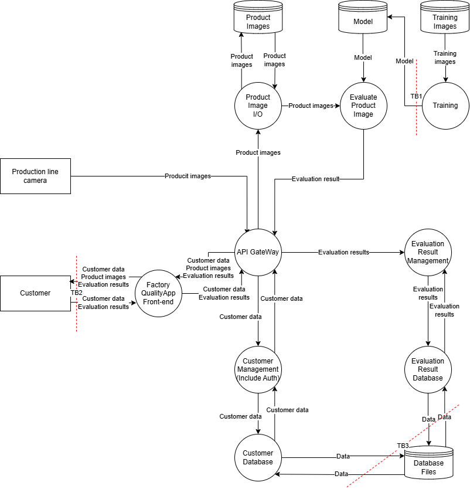
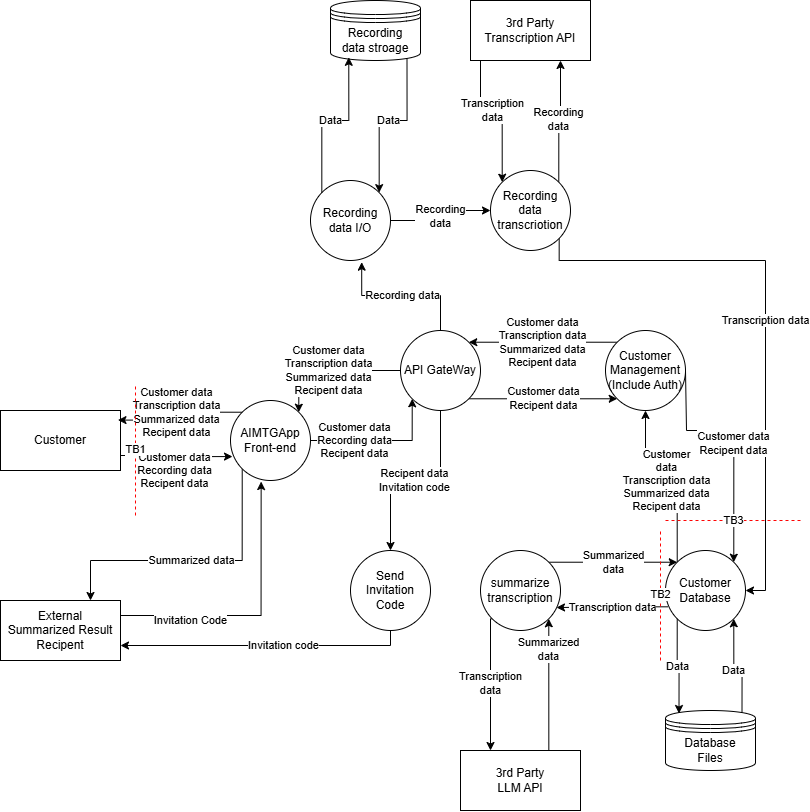
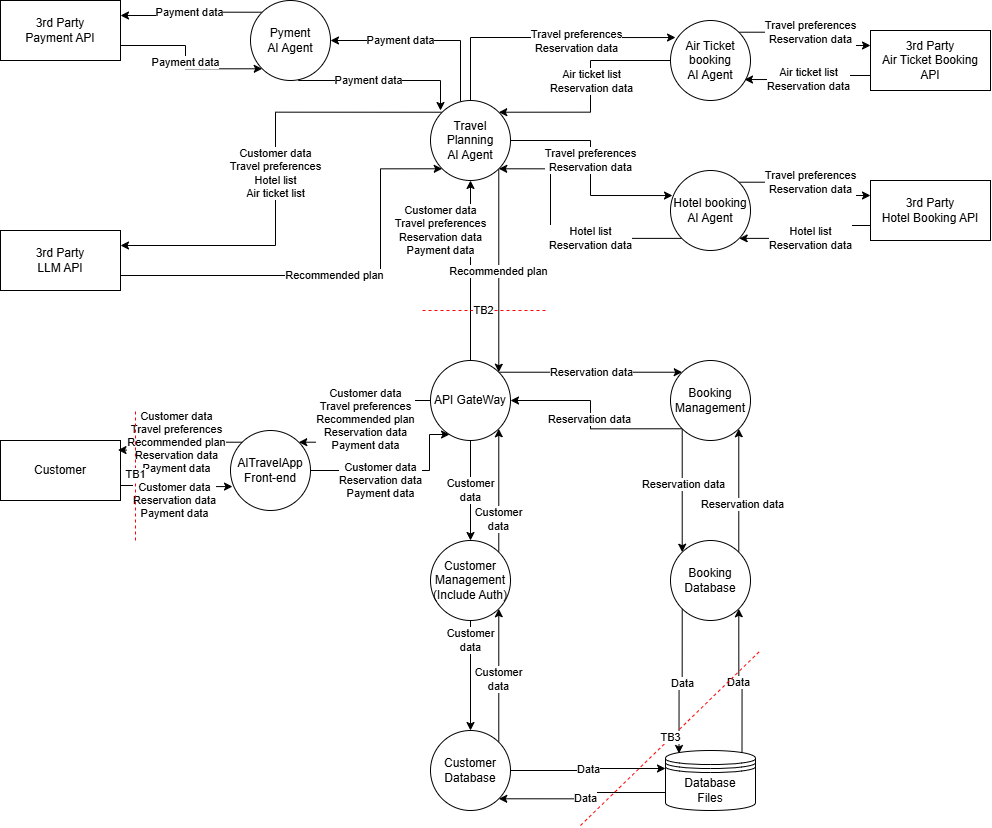

# STRIDE+AI
## 内部にAI機能を有するアプリケーション
### 信頼境界

### STRIDEテーブル
#### TB1
| TB1 | 緩和策 | 脆弱性 |
| --- | --- | --- |
|S|学習ジョブ/CI のサービス認証＋データ投入者の認証、データ供給元の真正性検証|不正な学習者/CIが正規ジョブになりすましてモデルを登録できる。＋攻撃者がデータ供給元になりすまし、悪性データを混入させる。|
|T|モデルの署名を利用した登録時/利用時の署名検証、通信経路の暗号化＋訓練データのデジタル署名検証|ネットワーク転送中やストレージ保管中にファイルが改ざんされる。＋訓練データ自体が汚染され、AIの認識精度低下や意図しない動作を引き起こす。|
|R|モデル登録/更新の監査ログ、相関ID付与＋学習データやパラメータの履歴保存|モデル更新の証跡が薄く、インシデント時に「誰が更新したか」を追跡できない／否認される＋「どのデータや設定で学習したモデルか」を特定できず、AIの異常動作の原因究明ができない。|
|I|モデル保管庫の最小権限、通信経路の暗号化＋推論API経由のアクセス制限とモデル重みデータの保護|モデルの不正取得（知財漏えい・モデル抽出の足掛かり）ができる＋外部公開されたAPIの応答結果などを分析され、AIの内部構造や学習データの機密情報が推測・抽出される。|
|D|学習/登録のジョブキュー、レート制限、リソース上限＋学習処理のサイズ制限やクラウド予算の上限設定|ジョブの大量発行などによるモデル更新プロセスの停止ができる＋意図的に巨大なデータや複雑な処理を投入され、機械学習用の計算資源や予算が枯渇する。|
|E|学習環境・モデル保管庫・推論環境の権限分離＋学習・登録・推論の各フェーズにおける役割ベースのアクセス制御|学習環境が侵害されると、モデル保管庫/推論側まで横展開し、高権限で改ざんできる＋学習環境の権限を悪用してモデル保管庫へ侵入し、悪意のあるモデルを本番環境へデプロイされる。|

#### TB2
| TB2 | 緩和策 | 脆弱性 |
| --- | --- | --- |
|S|MFAの導入、パスワードポリシーの強化、アカウントロックやセッション管理機能の導入|攻撃者が顧客になりすましてログイン（クレデンシャル詐取/総当たり）できる。セッション固定・トークン窃取が成立する。|
|T|通信データの暗号化、適切なパラメータ検証＋敵対的サンプルに対するモデルの堅牢化（ロバスト化）、入力画像の前処理|送信中やブラウザ経由で要求パラメータが改ざんされ、結果参照のID改ざんや不正な要求が成立する。＋敵対的サンプル（adversarial input）で誤判定を誘発し、品質検査を回避できる。|
|R|監査ログ（閲覧/DL/検索/共有等の重要操作）、相関ID付与＋入力画像データ、判定結果、適用モデルのバージョンを紐付けた推論ログの保存|誰がいつ結果を閲覧/ダウンロードしたか追えず、操作主体が否認できる。＋どの入力/どのモデルで判定されたか追えず、「AIの誤判定」を否認/追跡不能になる。|
|I|画面/ログのマスキング、キャッシュ制御、アクセス制御（オブジェクトレベル）、エラーメッセージ抑制、DLP＋APIや画面に返す判定結果の最小化（確信度の隠蔽など）、APIのレート制限|認識結果・製品画像が権限不備や画面キャッシュ/ログにより漏えいする。IDOR等で他ユーザの結果を見られる。＋外部からAPIへの連続的な問い合わせ結果を分析され、AIの学習データやモデル構造を推測・抽出される（モデル抽出攻撃）。|
|D|レート制限、WAF導入、アップロードサイズ上限＋推論処理の実行回数制限、推論用計算リソース（GPU等）の監視とコストアラート|大量アクセスや巨大画像アップロードでフロント/APIが過負荷になり、結果閲覧ができなくなる。＋意図的にAIの処理負荷が高い画像などを送信され、バックエンドの推論リソースを枯渇させられる（Sponge DoS / 高コストDoS）。|
|E|アクセス権限制御、認可制御、管理画面分離、CSP/クリックジャッキング対策、XSS対策|XSSや権限チェック不備で、一般ユーザが管理者相当の操作や他ユーザ資産にアクセスできる。|

#### TB3
| TB3 | 緩和策 | 脆弱性 |
| --- | --- | --- |
|S|サービス間認証、DB接続のIAM化、ネットワークアクセス制限|内部サービスになりすましてDBに接続できる（サービス間認証欠如／共有アカウント）|
|T|DB権限最小化、重要テーブルの整合性制約、改ざん検知＋判定ログの追記専用ストレージへの保存やハッシュ検証|判定結果や顧客データが不正に書き換えられたり削除される。＋蓄積された判定結果が密かに改ざんされ、将来のAI再学習用のデータが汚染されたり、AIの性能劣化の検知が妨害される。|
|R|DB監査ログ、相関ID付与|参照/更新の追跡ができず、データ操作を否認される|
|I|保存データと通信経路の暗号化、データマスキング＋判定結果の保存期間の最小化、不要な過去ログの破棄|データベースから顧客情報や過去の品質判定データが不正に読み取られる。＋蓄積された大量の判定結果（入力と出力のペア）が漏洩し、自社のAIモデルを複製するための学習データセットとして悪用される。|
|D|適切なクエリタイムアウト設定、アクセスレート制限|大量接続や高負荷のクエリでDBリソースが枯渇し、結果登録・閲覧機能が停止する|
|E|アクセス権限制御、認可制御|DB管理権限の奪取や設定ミスにより、一般サービスが管理者相当の操作を実行できる|

### リスクの評価と脅威
| ID | 脆弱性 | 悪用可能性 | 普及度 | 検知可能性 | 技術的影響 | スコア | リスク | 対策 |
| --- | --- | --- | --- | --- | --- | --- | --- | --- |
|V1|不正な学習者/CIが正規ジョブになりすましてモデルを登録できる。＋攻撃者がデータ供給元になりすまし、悪性データを混入させる。|2|2|3|3|7|HIGH|学習ジョブ/CI のサービス認証＋データ投入者の認証、データ供給元の真正性検証|
|V2|ネットワーク転送中やストレージ保管中にファイルが改ざんされる。＋訓練データ自体が汚染され、AIの認識精度低下や意図しない動作を引き起こす。|2|2|2|3|6|MID|モデルの署名を利用した登録時/利用時の署名検証、通信経路の暗号化＋訓練データのデジタル署名検証|
|V3|モデル更新の証跡が薄く、インシデント時に「誰が更新したか」を追跡できない／否認される＋「どのデータや設定で学習したモデルか」を特定できず、AIの異常動作の原因究明ができない。|1|2|2|2|3.3|MID|モデル登録/更新の監査ログ、相関ID付与＋学習データやパラメータの履歴保存|
|V4|モデルの不正取得（知財漏えい・モデル抽出の足掛かり）ができる＋外部公開されたAPIの応答結果などを分析され、AIの内部構造や学習データの機密情報が推測・抽出される。|2|2|2|2|4|MID|モデル保管庫の最小権限、通信経路の暗号化＋推論API経由のアクセス制限とモデル重みデータの保護|
|V5|ジョブの大量発行などによるモデル更新プロセスの停止ができる＋意図的に巨大なデータや複雑な処理を投入され、機械学習用の計算資源や予算が枯渇する。|2|2|2|2|4|MID|学習/登録のジョブキュー、レート制限、リソース上限＋学習処理のサイズ制限やクラウド予算の上限設定|
|V6|学習環境が侵害されると、モデル保管庫/推論側まで横展開し、高権限で改ざんできる＋学習環境の権限を悪用してモデル保管庫へ侵入し、悪意のあるモデルを本番環境へデプロイされる。|2|2|2|3|6|MID|学習環境・モデル保管庫・推論環境の権限分離＋学習・登録・推論の各フェーズにおける役割ベースのアクセス制御|
|V7|攻撃者が顧客になりすましてログイン（クレデンシャル詐取/総当たり）できる。セッション固定・トークン窃取が成立する。|3|2|2|2|4.7|MID|MFAの導入、パスワードポリシーの強化、アカウントロックやセッション管理機能の導入|
|V8|送信中やブラウザ経由で要求パラメータが改ざんされ、結果参照のID改ざんや不正な要求が成立する。＋敵対的サンプル（adversarial input）で誤判定を誘発し、品質検査を回避できる。|2|2|2|3|6|MID|通信データの暗号化、適切なパラメータ検証＋敵対的サンプルに対するモデルの堅牢化（ロバスト化）、入力画像の前処理|
|V9|誰がいつ結果を閲覧/ダウンロードしたか追えず、操作主体が否認できる。＋どの入力/どのモデルで判定されたか追えず、「AIの誤判定」を否認/追跡不能になる。|1|2|2|2|3.3|MID|監査ログ（閲覧/DL/検索/共有等の重要操作）、相関ID付与＋入力画像データ、判定結果、適用モデルのバージョンを紐付けた推論ログの保存|
|V10|認識結果・製品画像が権限不備や画面キャッシュ/ログにより漏えいする。IDOR等で他ユーザの結果を見られる。＋外部からAPIへの連続的な問い合わせ結果を分析され、AIの学習データやモデル構造を推測・抽出される（モデル抽出攻撃）。|2|2|2|2|4|MID|画面/ログのマスキング、キャッシュ制御、アクセス制御（オブジェクトレベル）、エラーメッセージ抑制、DLP＋APIや画面に返す判定結果の最小化（確信度の隠蔽など）、APIのレート制限|
|V11|大量アクセスや巨大画像アップロードでフロント/APIが過負荷になり、結果閲覧ができなくなる。＋意図的にAIの処理負荷が高い画像などを送信され、バックエンドの推論リソースを枯渇させられる（Sponge DoS / 高コストDoS）。|2|2|2|2|4|MID|レート制限、WAF導入、アップロードサイズ上限＋推論処理の実行回数制限、推論用計算リソース（GPU等）の監視とコストアラート|
|V12|XSSや権限チェック不備で、一般ユーザが管理者相当の操作や他ユーザ資産にアクセスできる。|2|2|2|3|6|MID|アクセス権限制御、認可制御、管理画面分離、CSP/クリックジャッキング対策、XSS対策|
|V13|内部サービスになりすましてDBに接続できる（サービス間認証欠如／共有アカウント）|2|2|2|3|6|MID|サービス間認証、DB接続のIAM化、ネットワークアクセス制限|
|V14|判定結果や顧客データが不正に書き換えられたり削除される。＋蓄積された判定結果が密かに改ざんされ、将来のAI再学習用のデータが汚染されたり、AIの性能劣化の検知が妨害される。|2|2|2|2|4|MID|DB権限最小化、重要テーブルの整合性制約、改ざん検知＋判定ログの追記専用ストレージへの保存やハッシュ検証|
|V15|参照/更新の追跡ができず、データ操作を否認される|1|2|2|2|3.3|MID|DB監査ログ、相関ID付与|
|V16|データベースから顧客情報や過去の品質判定データが不正に読み取られる。＋蓄積された大量の判定結果（入力と出力のペア）が漏洩し、自社のAIモデルを複製するための学習データセットとして悪用される。|1|2|2|3|5|MID|保存データと通信経路の暗号化、データマスキング＋判定結果の保存期間の最小化、不要な過去ログの破棄|
|V17|大量接続や高負荷のクエリでDBリソースが枯渇し、結果登録・閲覧機能が停止する|2|2|2|2|4|MID|適切なクエリタイムアウト設定、アクセスレート制限|
|V18|DB管理権限の奪取や設定ミスにより、一般サービスが管理者相当の操作を実行できる|2|2|2|3|6|MID|アクセス権限制御、認可制御|

## 外部のLLMを用いたアプリケーション
### 信頼境界

### STRIDEテーブル
#### TB1
| TB1 | 緩和策 | 脆弱性 |
| --- | --- | --- |
|S|多要素認証（MFA）の導入、セッションの短命化、デバイスや行動ベースの異常検知|攻撃者が顧客のアカウントを乗っ取り、他人の録音データや要約結果に不正アクセスする。|
|T|通信の暗号化、CSRF対策、アップロードファイルの形式・サイズ検証＋LLMへの入力テキストのサニタイズ、プロンプトインジェクション対策|リクエストが改ざんされ、共有先や要約IDが不正に変更される。＋会議の発言（録音）内に悪意のある指示を含めることでAIを騙し、不正なリンクや意図しない要約を生成させる（間接的プロンプトインジェクション）。|
|R|共有やダウンロードなどの重要操作の監査ログ取得、改ざん耐性のあるログ管理＋AIによる初期生成結果と、ユーザによる手動修正履歴の分離・保存|誰が要約を共有・閲覧したかの痕跡をたどれず、不正な操作を否認される。＋共有された要約内容に問題があった際、「AIの誤生成（ハルシネーション）」か「ユーザの意図的な改ざん」かを特定できず責任が曖昧になる。|
|I|オブジェクトレベルの認可制御、画面やログのマスキング＋システムプロンプトの秘匿化、LLM出力の監視・フィルタリング|アクセス制御の不備（IDORなど）により、招待コードや要約結果が第三者に漏洩する。＋悪意のある音声やテキストを入力され、システム内部でLLMに設定されているシステムプロンプトが抽出・漏洩する。|
|D|レート制限、アップロードサイズの上限設定、WAFの導入＋外部APIの処理トークン数上限設定、サードパーティAPIのコストアラート監視|大量のアクセスや巨大ファイルのアップロードにより、Webフロントエンドが過負荷になり停止する。＋意図的に長時間の録音データなどを大量に送信され、サードパーティAPI（文字起こし・LLM）の利用枠や予算が枯渇する（高コストDoS）。|
|E|アクセス権限制御、XSS対策などのセキュアコーディング|アプリケーションの脆弱性（XSSなど）を悪用され、一般ユーザが管理権限を奪取したり他人のデータへアクセスしたりする。|

#### TB2
| TB2 | 緩和策 | 脆弱性 |
| --- | --- | --- |
|S|外部APIキーの安全な保管、送信元IPの制限やmTLSの導入|攻撃者にAPIキーを窃取され、自社の契約枠で外部APIを不正利用される。または、攻撃者が外部APIになりすまして偽の応答を返す。|
|T|通信の暗号化、リクエスト署名による応答の検証＋外部APIへ送信するプロンプトのサニタイズ|通信経路上の改ざんにより、リクエストや応答データが書き換えられる。＋会議データに混入した悪意のある発言によってAIが騙され、意図しない要約や不適切なテキストを生成させられる。|
|R|外部APIの基本的な通信ログの取得＋送信した入力データ（ハッシュ値）、利用モデルのバージョン、パラメータ設定の記録|通信エラーや障害発生時に、システム側と外部API側のどちらに問題があったか追跡できない。＋異常な要約が生成された際、「どのような入力と設定でLLMに指示を出したか」を特定できず原因究明ができない。|
|I|通信の暗号化、個人情報のマスキングによる送信データの最小化＋サードパーティAPI側の「学習利用のオプトアウト」設定の確実な適用|通信の傍受により、会議の音声やテキストデータが第三者に漏洩する。＋機密情報を含む会議内容が外部AIの再学習データとして取り込まれ、結果として他社へ情報が漏洩する。|
|D|適切なタイムアウト設定、リトライ制御、サーキットブレーカーの導入|外部API側の遅延や障害にシステムが巻き込まれ、文字起こしや要約機能が停止する。|
|E|API呼び出し権限の最小限化＋LLMの出力結果を盲信しないシステム設計（出力の無害化、検証プロセスへの人間介入の検討）|権限設定の不備により、他の内部サービスからAPI実行権限を不正利用される。＋LLMが生成した不正なテキストやコードをシステムがそのまま信用して後続処理に回してしまい、意図しないデータ操作や権限昇格を引き起こす。|

#### TB3
| TB3 | 緩和策 | 脆弱性 |
| --- | --- | --- |
|S|内部サービス間のアクセス認証、データベース接続のネットワーク分離|攻撃者が内部の正規サービスになりすましてデータベースに接続し、不正な操作を行う。|
|T|データベースの権限最小化、監査テーブルの導入、データの整合性制約、定期的なバックアップと復元テスト|データベース内に保存された会議の録音、文字起こしテキスト、要約結果や共有先情報が不正に書き換えられたり削除されたりする。|
|R|データベースに対するすべての操作ログの取得、改ざん防止機能付きストレージでのログ保管|データベースに対する直接的な操作の追跡ができず、誰が機密性の高い要約データを閲覧・変更したかを特定できない。|
|I|保存データと通信経路の暗号化、列レベルのマスキング、DLPの導入、バックアップデータの保護|データベースやバックアップファイルから、機密性の高い会議の録音データや文字起こしテキストがまとめて不正に読み取られ、情報漏洩する。|
|D|クエリの実行時間制限、同時接続数の上限設定、適切なインデックス設計とリソース監視|意図的に負荷の高いクエリを実行されたり大量の接続要求を発生させられたりしてデータベースが停止し、アプリケーション全体の機能が利用できなくなる。|
|E|厳密な役割ベースのアクセス制御、管理ネットワークの分離、DB認証情報の安全な管理|権限設定の不備などを突かれ、一般サービスや攻撃者がデータベースの管理者権限を奪取し、すべてのデータを自由に閲覧・操作できる状態になる。|

### リスクの評価と脅威
| ID | 脆弱性 | 悪用可能性 | 普及度 | 検知可能性 | 技術的影響 | スコア | リスク | 対策 |
| --- | --- | --- | --- | --- | --- | --- | --- | --- |
|V1|攻撃者が顧客のアカウントを乗っ取り、他人の録音データや要約結果に不正アクセスする。|3|2|2|3|7|MID|多要素認証（MFA）の導入、セッションの短命化、デバイスや行動ベースの異常検知|
|V2|リクエストが改ざんされ、共有先や要約IDが不正に変更される。＋会議の発言（録音）内に悪意のある指示を含めることでAIを騙し、不正なリンクや意図しない要約を生成させる（間接的プロンプトインジェクション）。|2|2|2|3|6|MID|通信の暗号化、CSRF対策、アップロードファイルの形式・サイズ検証＋LLMへの入力テキストのサニタイズ、プロンプトインジェクション対策|
|V3|誰が要約を共有・閲覧したかの痕跡をたどれず、不正な操作を否認される。＋共有された要約内容に問題があった際、「AIの誤生成（ハルシネーション）」か「ユーザの意図的な改ざん」かを特定できず責任が曖昧になる。|1|2|2|2|3.3|MID|共有やダウンロードなどの重要操作の監査ログ取得、改ざん耐性のあるログ管理＋AIによる初期生成結果と、ユーザによる手動修正履歴の分離・保存|
|V4|アクセス制御の不備（IDORなど）により、招待コードや要約結果が第三者に漏洩する。＋悪意のある音声やテキストを入力され、システム内部でLLMに設定されているシステムプロンプトが抽出・漏洩する。|2|2|2|3|6|MID|オブジェクトレベルの認可制御、画面やログのマスキング＋システムプロンプトの秘匿化、LLM出力の監視・フィルタリング|
|V5|大量のアクセスや巨大ファイルのアップロードにより、Webフロントエンドが過負荷になり停止する。＋意図的に長時間の録音データなどを大量に送信され、サードパーティAPI（文字起こし・LLM）の利用枠や予算が枯渇する（高コストDoS）。|2|2|2|3|6|MID|レート制限、アップロードサイズの上限設定、WAFの導入＋外部APIの処理トークン数上限設定、サードパーティAPIのコストアラート監視|
|V6|アプリケーションの脆弱性（XSSなど）を悪用され、一般ユーザが管理権限を奪取したり他人のデータへアクセスしたりする。|2|2|2|3|6|MID|アクセス権限制御、XSS対策などのセキュアコーディング|
|V7|攻撃者にAPIキーを窃取され、自社の契約枠で外部APIを不正利用される。または、攻撃者が外部APIになりすまして偽の応答を返す。|2|2|2|3|6|MID|外部APIキーの安全な保管、送信元IPの制限やmTLSの導入|
|V8|通信経路上の改ざんにより、リクエストや応答データが書き換えられる。＋会議データに混入した悪意のある発言によってAIが騙され、意図しない要約や不適切なテキストを生成させられる。|2|2|2|3|6|MID|通信の暗号化、リクエスト署名による応答の検証＋外部APIへ送信するプロンプトのサニタイズ|
|V9|通信エラーや障害発生時に、システム側と外部API側のどちらに問題があったか追跡できない。＋異常な要約が生成された際、「どのような入力と設定でLLMに指示を出したか」を特定できず原因究明ができない。|1|2|2|2|3.3|MID|外部APIの基本的な通信ログの取得＋送信した入力データ（ハッシュ値）、利用モデルのバージョン、パラメータ設定の記録|
|V10|通信の傍受により、会議の音声やテキストデータが第三者に漏洩する。＋機密情報を含む会議内容が外部AIの再学習データとして取り込まれ、結果として他社へ情報が漏洩する。|2|3|2|3|7|HIGH|通信の暗号化、個人情報のマスキングによる送信データの最小化＋サードパーティAPI側の「学習利用のオプトアウト」設定の確実な適用|
|V11|外部API側の遅延や障害にシステムが巻き込まれ、文字起こしや要約機能が停止する。|2|2|2|2|4|MID|適切なタイムアウト設定、リトライ制御、サーキットブレーカーの導入|
|V12|権限設定の不備により、他の内部サービスからAPI実行権限を不正利用される。＋LLMが生成した不正なテキストやコードをシステムがそのまま信用して後続処理に回してしまい、意図しないデータ操作や権限昇格を引き起こす。|2|2|2|3|6|MID|API呼び出し権限の最小限化＋LLMの出力結果を盲信しないシステム設計（出力の無害化、検証プロセスへの人間介入の検討）|
|V13|攻撃者が内部の正規サービスになりすましてデータベースに接続し、不正な操作を行う。|2|2|2|3|6|MID|内部サービス間のアクセス認証、データベース接続のネットワーク分離|
|V14|データベース内に保存された会議の録音、文字起こしテキスト、要約結果や共有先情報が不正に書き換えられたり削除されたりする。|2|2|2|3|6|MID|データベースの権限最小化、監査テーブルの導入、データの整合性制約、定期的なバックアップと復元テスト|
|V15|データベースに対する直接的な操作の追跡ができず、誰が機密性の高い要約データを閲覧・変更したかを特定できない。|1|2|2|2|3.3|MID|データベースに対するすべての操作ログの取得、改ざん防止機能付きストレージでのログ保管|
|V16|データベースやバックアップファイルから、機密性の高い会議の録音データや文字起こしテキストがまとめて不正に読み取られ、情報漏洩する。|2|2|2|3|6|MID|保存データと通信経路の暗号化、列レベルのマスキング、DLPの導入、バックアップデータの保護|
|V17|意図的に負荷の高いクエリを実行されたり大量の接続要求を発生させられたりしてデータベースが停止し、アプリケーション全体の機能が利用できなくなる。|2|2|2|2|4|MID|クエリの実行時間制限、同時接続数の上限設定、適切なインデックス設計とリソース監視|
|V18|権限設定の不備などを突かれ、一般サービスや攻撃者がデータベースの管理者権限を奪取し、すべてのデータを自由に閲覧・操作できる状態になる。|2|2|2|3|6|MID|厳密な役割ベースのアクセス制御、管理ネットワークの分離、DB認証情報の安全な管理|

## エージェント型AIを用いたアプリケーション
### 信頼境界

### STRIDEテーブル
#### TB1
| TB1 | 緩和策 | 脆弱性 |
| --- | --- | --- |
|S|多要素認証（MFA）の導入、セッショントークンの短命化、ログイン時の異常検知|攻撃者が顧客のアカウントを乗っ取り、他人の旅行嗜好や予約・決済情報に不正アクセスする。|
|T|通信の暗号化、CSRF対策、入力パラメータ（予約日程や金額など）の厳密な検証＋LLMへの入力テキストのサニタイズ、プロンプトインジェクション対策、AIエージェントの操作権限の制限|リクエストが改ざんされ、他人の予約IDや金額が不正に変更される。＋対話インターフェースに悪意のある指示を入力され（プロンプトインジェクション）、AIアシスタントを騙して不正な割引を引き出したり、意図しない予約・決済操作を誘発させられたりする。|
|R|監査ログ、改ざん耐性のあるログ管理＋AIとの対話履歴の完全な保存と、最終実行前のユーザー同意ログの取得|予約や決済の操作主体が特定できず、不正操作を否認される。＋巧みな質問によってAIアシスタントが騙され、内部のシステムプロンプトや、他のAIエージェントが保持している非公開のAPI情報などを喋らされてしまう（プロンプト漏洩）。|
|I|オブジェクトレベルの認可制御、画面やログのマスキング＋システムプロンプトの秘匿化、LLM出力の監視・フィルタリング|アクセス権限の設定不備などにより、他人の顧客データや決済情報が漏洩する。＋巧みな質問によってAIアシスタントが騙され、内部のシステムプロンプトや、他のAIエージェントが保持している非公開のAPI情報などを喋らされてしまう（プロンプト漏洩）。|
|D|レート制限、入力サイズの上限設定、WAFの導入＋対話のターン数や入力トークン数の上限設定、AIエージェントおよび外部APIのコストアラート監視|大量のアクセスによりWebフロントエンドが過負荷状態となり、予約操作ができなくなる。＋意図的に極端に複雑な旅行条件などを大量に送信され、AIエージェントの計算リソースや外部APIの予算を枯渇させられる。|
|E|厳密なアクセス権限制御、管理機能の分離、XSS対策などのセキュアコーディング|アプリケーションの脆弱性（XSSなど）を悪用され、一般ユーザーが権限を昇格して他人の予約の参照・取消・決済を行ってしまう。|

#### TB2
| TB2 | 緩和策 | 脆弱性 |
| --- | --- | --- |
|S|内部サービス間の相互認証、エージェント識別子の厳密な管理|侵害された内部システムや他のサービスが、決済や予約の実行権限を持つ正規のAIエージェントになりすまし、不正な処理を行う。|
|T|内部通信の暗号化と署名検証、API連携時のパラメータ型・範囲の厳密な検証＋外部APIから返ってくる応答テキストの無害化（サニタイズ）|通信経路上で予約内容や決済金額のパラメータが改ざんされる。＋外部システム（ホテルや航空会社のAPI）からの応答データに悪意のあるテキストが混入しており、それを受け取ったAIエージェントが騙されて誤予約などを実行させられる（間接的プロンプトインジェクション）。|
|R|各サービス間のAPI呼び出しに関する標準的な監査ログ取得、相関IDの付与＋エージェントの推論過程（思考プロセス）、ツール呼び出しの入出力、使用されたプロンプトの完全な記録|エラーや不正予約が発生した際、どのシステム間通信で問題が起きたかの技術的な追跡ができない。＋AIが自律的に複数のエージェントやツールを呼び出すため、「ユーザーのどの指示が起点となり、なぜAIがそのツールを実行したのか」という一連の意思決定プロセスを追跡・証明できない。|
|I|通信経路の暗号化、ログへの機密情報出力の防止やマスキング対応＋各エージェントに渡すプロンプトに含める顧客情報の最小化、サードパーティLLMに対する学習利用のオプトアウト|通信の傍受やログの不適切な管理により、顧客の旅行嗜好や個人情報がシステム内部で漏洩する。＋AIエージェントが処理の過程で過剰な顧客情報（決済情報や詳細な住所など）をプロンプトに含めてしまい、外部のLLMやサードパーティAPIへ不必要に機密データを送信してしまう。|
|D|適切なタイムアウト設定、システム間の通信レート制限、サーキットブレーカーの導入＋AIエージェントの自律的なツール実行（再試行）のループ回数上限設定、外部APIの利用コストアラート|他サービスからの大量の通信によりAPI Gatewayやバックエンドが過負荷となり、予約処理が遅延・停止する。＋AIエージェントがエラーの解釈を誤り、予約や検索のツール呼び出しを無限ループで再試行し続け、外部APIの利用枠やクラウド費用を甚大に消費する。|
|E|サービス間通信における最小権限の原則（APIへのアクセス認可制御）＋エージェントごとに実行可能な機能の制限、決済など重要操作に対する人間による承認プロセスの強制|権限設定の不備により、権限の低い内部サービスが予約の確定や決済のAPIを直接叩いてしまう。＋プロンプトインジェクションやAIの誤作動により、AIエージェントが自身の持つツール実行権限を悪用し、ユーザーの意図しない決済の確定や予約の取消といった高権限の操作を自律的に進めてしまう。|

#### TB3
| TB3 | 緩和策 | 脆弱性 |
| --- | --- | --- |
|S|データベース接続の強固な認証、ネットワークの分離、内部サービス間のアクセス認証|攻撃者が侵害した内部サービスを踏み台にして正規サービスになりすまし、データベースに接続してすべてのデータを不正に取得する。|
|T|データベースの権限最小化、監査テーブルの導入、データの整合性制約|データベース内に保存された顧客の旅行予約データや決済ステータスが不正に書き換えられたり、削除されたりする。|
|R|監査ログ、システム全体を通した相関IDの付与|データベースに対する直接的なデータ操作の痕跡をたどれず、誰が予約データを改ざんしたか、あるいは決済連携の不具合がいつ起きたのかを特定（証明）できない。|
|I|保存データと通信経路の暗号化、重要データのマスキング、DLPの導入|データベースやバックアップファイルから、機密性の高い顧客の旅行嗜好、クレジットカードなどの決済情報、詳細な予約情報がまとめて不正に読み取られ、情報漏洩する。|
|D|同時接続数の上限設定、クエリの実行時間制限、パフォーマンス監視と異常時のフェイルオーバー構成|意図的に負荷の高いクエリを実行されたり大量の接続要求を発生させられたりしてデータベースがロック状態に陥り、予約管理システム全体が停止する。|
|E|最小権限の原則に基づくアクセス制御、管理用ネットワークの分離|権限設定の不備などを突かれ、一般サービスや攻撃者がデータベースの管理者権限を奪取し、全予約の取消しや全顧客情報の参照など、致命的な操作を自由に実行できる状態になる。|

### リスクの評価と脅威
| ID | 脆弱性 | 悪用可能性 | 普及度 | 検知可能性 | 技術的影響 | スコア | リスク | 対策 |
| --- | --- | --- | --- | --- | --- | --- | --- | --- |
|V1|攻撃者が顧客のアカウントを乗っ取り、他人の旅行嗜好や予約・決済情報に不正アクセスする。|3|2|2|3|7|HIGH|多要素認証（MFA）の導入、セッショントークンの短命化、ログイン時の異常検知|
|V2|リクエストが改ざんされ、他人の予約IDや金額が不正に変更される。＋対話インターフェースに悪意のある指示を入力され（プロンプトインジェクション）、AIアシスタントを騙して不正な割引を引き出したり、意図しない予約・決済操作を誘発させられたりする。|2|2|2|3|6|MID|通信の暗号化、CSRF対策、入力パラメータ（予約日程や金額など）の厳密な検証＋LLMへの入力テキストのサニタイズ、プロンプトインジェクション対策、AIエージェントの操作権限の制限|
|V3|予約や決済の操作主体が特定できず、不正操作を否認される。＋巧みな質問によってAIアシスタントが騙され、内部のシステムプロンプトや、他のAIエージェントが保持している非公開のAPI情報などを喋らされてしまう（プロンプト漏洩）。|1|2|2|2|3.3|MID|監査ログ、改ざん耐性のあるログ管理＋AIとの対話履歴の完全な保存と、最終実行前のユーザー同意ログの取得|
|V4|アクセス権限の設定不備などにより、他人の顧客データや決済情報が漏洩する。＋巧みな質問によってAIアシスタントが騙され、内部のシステムプロンプトや、他のAIエージェントが保持している非公開のAPI情報などを喋らされてしまう（プロンプト漏洩）。|2|2|2|3|6|MID|オブジェクトレベルの認可制御、画面やログのマスキング＋システムプロンプトの秘匿化、LLM出力の監視・フィルタリング|
|V5|大量のアクセスによりWebフロントエンドが過負荷状態となり、予約操作ができなくなる。＋意図的に極端に複雑な旅行条件などを大量に送信され、AIエージェントの計算リソースや外部APIの予算を枯渇させられる。|2|2|2|3|6|MID|レート制限、入力サイズの上限設定、WAFの導入＋対話のターン数や入力トークン数の上限設定、AIエージェントおよび外部APIのコストアラート監視|
|V6|アプリケーションの脆弱性（XSSなど）を悪用され、一般ユーザーが権限を昇格して他人の予約の参照・取消・決済を行ってしまう。|2|2|2|3|6|MID|厳密なアクセス権限制御、管理機能の分離、XSS対策などのセキュアコーディング|
|V7|侵害された内部システムや他のサービスが、決済や予約の実行権限を持つ正規のAIエージェントになりすまし、不正な処理を行う。|2|2|2|3|6|MID|内部サービス間の相互認証、エージェント識別子の厳密な管理|
|V8|通信経路上で予約内容や決済金額のパラメータが改ざんされる。＋外部システム（ホテルや航空会社のAPI）からの応答データに悪意のあるテキストが混入しており、それを受け取ったAIエージェントが騙されて誤予約などを実行させられる（間接的プロンプトインジェクション）。|2|2|2|3|6|MID|内部通信の暗号化と署名検証、API連携時のパラメータ型・範囲の厳密な検証＋外部APIから返ってくる応答テキストの無害化（サニタイズ）|
|V9|エラーや不正予約が発生した際、どのシステム間通信で問題が起きたかの技術的な追跡ができない。＋AIが自律的に複数のエージェントやツールを呼び出すため、「ユーザーのどの指示が起点となり、なぜAIがそのツールを実行したのか」という一連の意思決定プロセスを追跡・証明できない。|1|2|2|2|3.3|MID|各サービス間のAPI呼び出しに関する標準的な監査ログ取得、相関IDの付与＋エージェントの推論過程（思考プロセス）、ツール呼び出しの入出力、使用されたプロンプトの完全な記録|
|V10|通信の傍受やログの不適切な管理により、顧客の旅行嗜好や個人情報がシステム内部で漏洩する。＋AIエージェントが処理の過程で過剰な顧客情報（決済情報や詳細な住所など）をプロンプトに含めてしまい、外部のLLMやサードパーティAPIへ不必要に機密データを送信してしまう。|2|2|2|3|6|MID|通信経路の暗号化、ログへの機密情報出力の防止やマスキング対応＋各エージェントに渡すプロンプトに含める顧客情報の最小化、サードパーティLLMに対する学習利用のオプトアウト|
|V11|他サービスからの大量の通信によりAPI Gatewayやバックエンドが過負荷となり、予約処理が遅延・停止する。＋AIエージェントがエラーの解釈を誤り、予約や検索のツール呼び出しを無限ループで再試行し続け、外部APIの利用枠やクラウド費用を甚大に消費する。|2|2|2|3|6|MID|適切なタイムアウト設定、システム間の通信レート制限、サーキットブレーカーの導入＋AIエージェントの自律的なツール実行（再試行）のループ回数上限設定、外部APIの利用コストアラート|
|V12|権限設定の不備により、権限の低い内部サービスが予約の確定や決済のAPIを直接叩いてしまう。＋プロンプトインジェクションやAIの誤作動により、AIエージェントが自身の持つツール実行権限を悪用し、ユーザーの意図しない決済の確定や予約の取消といった高権限の操作を自律的に進めてしまう。|2|2|2|3|6|MID|サービス間通信における最小権限の原則（APIへのアクセス認可制御）＋エージェントごとに実行可能な機能の制限、決済など重要操作に対する人間による承認プロセスの強制|
|V13|攻撃者が侵害した内部サービスを踏み台にして正規サービスになりすまし、データベースに接続してすべてのデータを不正に取得する。|2|2|2|3|6|MID|データベース接続の強固な認証、ネットワークの分離、内部サービス間のアクセス認証|
|V14|データベース内に保存された顧客の旅行予約データや決済ステータスが不正に書き換えられたり、削除されたりする。|2|2|2|3|6|MID|データベースの権限最小化、監査テーブルの導入、データの整合性制約|
|V15|データベースに対する直接的なデータ操作の痕跡をたどれず、誰が予約データを改ざんしたか、あるいは決済連携の不具合がいつ起きたのかを特定（証明）できない。|1|2|2|2|3.3|MID|監査ログ、システム全体を通した相関IDの付与|
|V16|データベースやバックアップファイルから、機密性の高い顧客の旅行嗜好、クレジットカードなどの決済情報、詳細な予約情報がまとめて不正に読み取られ、情報漏洩する。|2|2|2|3|6|MID|保存データと通信経路の暗号化、重要データのマスキング、DLPの導入|
|V17|意図的に負荷の高いクエリを実行されたり大量の接続要求を発生させられたりしてデータベースがロック状態に陥り、予約管理システム全体が停止する。|2|2|2|2|4|MID|同時接続数の上限設定、クエリの実行時間制限、パフォーマンス監視と異常時のフェイルオーバー構成|
|V18|権限設定の不備などを突かれ、一般サービスや攻撃者がデータベースの管理者権限を奪取し、全予約の取消しや全顧客情報の参照など、致命的な操作を自由に実行できる状態になる。|2|2|2|3|6|MID|最小権限の原則に基づくアクセス制御、管理用ネットワークの分離|