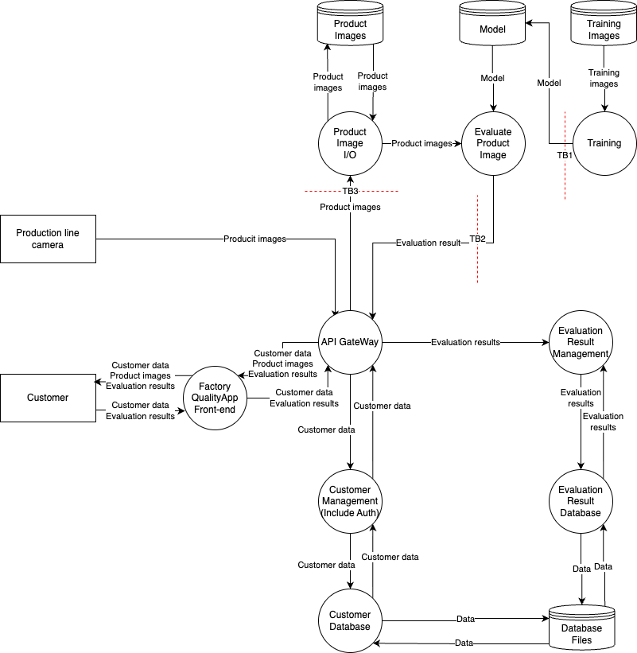
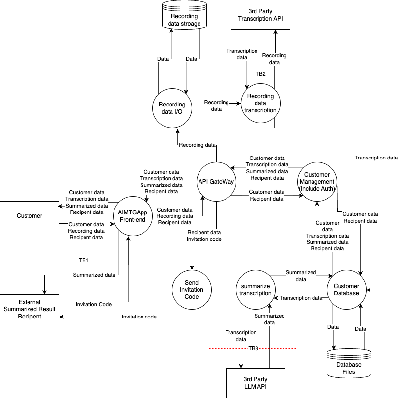
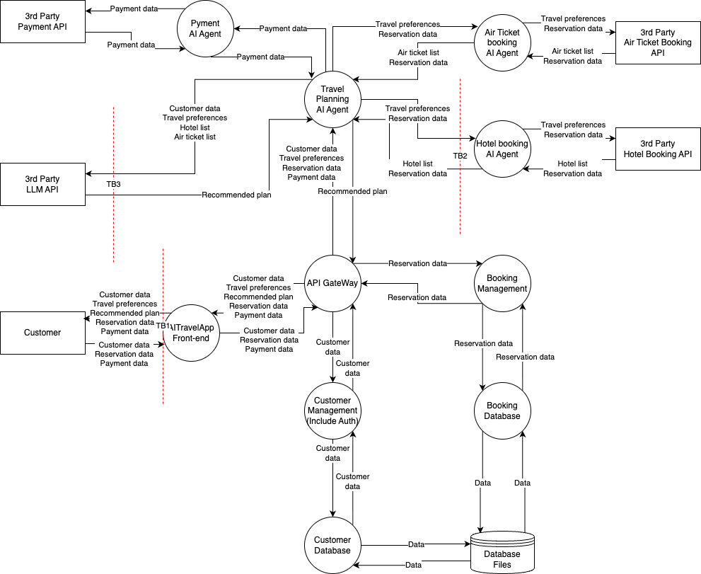

# STRIDE+AI
## Application with Built-in AI Functionality
### Trust Boundaries

### STRIDE Table
#### TB1

| TB1 | Mitigation | Vulnerability |
| ---- | ------------------------------------------------------------ | ------------------------------------------------------------ |
| S | Strong authentication of data sources and verification by digital signature at data ingestion | An unauthorized data provider impersonates a trusted source and mixes in low-quality images |
| T | Statistical anomaly detection on the dataset, data sanitization (cleansing), and adoption of "robust training" | A specific trigger is planted in the training data so that the item is judged good regardless of what its "contents" are |
| R | Immutable audit logs in the MLOps pipeline and hash value management for models and data | It is impossible to trace who trained the model with which dataset, or the change history (lineage) |
| I | Encryption of stored data, prevention of individual identification by applying differential privacy | Confidential information contained in the training images, and the model's architecture and weights, leak externally |
| D | Resource quota limits and validation of the size and format of input data | Send in a large volume of meaningless data or huge files to exhaust the training resources |
| E | Separation of the pipeline execution environment (sandboxing) and application of the principle of least privilege | Abuse the training job's privileges to gain unauthorized access to the production data store |

#### TB2

| TB2 | Mitigation | Vulnerability |
| ---- | ------------------------------------------------------------ | ------------------------------------------------------------ |
| S | Mutual TLS (mTLS) authentication between the API Gateway and the inference process | An unauthorized process impersonates the evaluation process (Evaluate Product Image) and sends fake evaluation results |
| T | Implement encryption of communications + Implementation of Adversarial Training and application of a preprocessing filter to input images | Rewrite the "Evaluation result" judged by the AI before it reaches the management component + Add noise to an image to make a defective product be misrecognized as a good one |
| R | Centrally manage the execution logs of the evaluation process + Introduction of XAI (explainable AI) technology and logging of the inputs and confidence scores at inference time | No trace remains that the AI's evaluation process was executed, so responsibility for a misjudgment cannot be traced + When the AI misjudges, the basis for the judgment (explainability) — why it arrived at that output — cannot be explained |
| I | Unencrypted "Customer data" flowing over the internal network is intercepted | Encryption of internal communications, suppression of unnecessary internal data transfers |
| D | Send excessive requests to the evaluation process to exhaust resources | Throttling by the API Gateway, introduction of queue processing |
| E |                                                              |                                                              |

#### TB3

| TB3 | Mitigation | Vulnerability |
| ---- | ------------------------------------------------------------ | ------------------------------------------------------------ |
| S | Access control for the storage | An unauthorized script impersonates "Product Image I/O" and deletes or overwrites images in the storage |
| T | Hash value management for files, consideration of immutable storage (WORM) | Rewrite the "Product Images" in the storage to cause defects in the AI's retraining and re-evaluation |
| R | Enabling of audit logs for storage operations | There is no record of who uploaded or changed images and when, so unauthorized operations cannot be identified |
| I | Settings that block public access, encryption (server-side encryption) | A misconfiguration exposes the "Product Images" folder externally, leaking the state of the production line |
| D | Setting of storage quotas, monitoring and alert notifications | Deliberately exhaust the storage capacity to obstruct the saving of images from the line camera |
| E | Exploit a vulnerability in the I/O process to access other database files on the same server | Minimization of privileges |

### Risk Assessment and Threats

| ID | Threat | Ease of Exploit | Awareness | Intrusion Detection | Technical Impact | Score | Risk | Specific Mitigation |
| ------ | ---------------------------------------------- | ---- | ---- | ---- | ---- | ---------- | ------ | ------------------------------------------------------------ |
| V1 | [S] Image injection by a fake line camera | 1 | 1 | 2 | 3 | 4 | MID | Authentication using device certificates |
| V2 | [T] Poisoning of the training images | 1 | 1 | 1 | 3 | 3 | LOW | Ensuring the immutability of the dataset |
| V3 | [R] Ignoring failures to save images | 1 | 1 | 2 | 2 | 2.66666667 | LOW | Liveness monitoring of the I/O status |
| V4 | [I] External exposure due to storage misconfiguration | 2 | 2 | 2 | 3 | 6 | MID | Automation of configuration scanning |
| V5 | [D] Write latency due to exhaustion of I/O bandwidth | 2 | 2 | 3 | 3 | 7 | MID | Reservation of storage IOPS |
| V6 | [E] Intrusion into the data store by abusing a training job | 2 | 2 | 2 | 3 | 6 | MID | Separation of the execution environment (sandboxing), application of the principle of least privilege (IAM) |
| V7 | [S] Launch of a fake evaluation process | 1 | 1 | 2 | 3 | 4 | MID | Hash verification of the executable |
| V8 | [T] Rewriting of the result + misrecognition caused by adversarial noise | 2 | 2 | 3 | 3 | 7 | HIGH | Encryption of communications, implementation of adversarial training, a preprocessing filter for input images |
| V9 | [R] Absence of execution traces + absence of the basis for judgment (XAI) | 1 | 2 | 2 | 2 | 3.33333333 | MID | Centralized management of execution logs, recording of the basis for judgment using XAI (explainable AI) |
| V10 | [I] Leakage of model data in memory | 2 | 2 | 2 | 2 | 4 | MID | Consideration of memory encryption technology |
| V11 | [D] Resource exhaustion of the image processing process | 2 | 2 | 2 | 3 | 6 | MID | Resource limits |
| V12 | [S] Image injection by a fake line camera | 1 | 1 | 2 | 3 | 4 | MID | Authentication using device certificates |
| V13 | [T] Poisoning of the training images | 1 | 1 | 1 | 3 | 3 | LOW | Ensuring the immutability of the dataset |
| V14 | [R] Ignoring failures to save images | 1 | 1 | 2 | 2 | 2.66666667 | LOW | Liveness monitoring of the I/O status |
| V15 | [I] External exposure due to storage misconfiguration | 2 | 2 | 2 | 3 | 6 | MID | Automation of configuration scanning |
| V16 | [D] Write latency due to exhaustion of I/O bandwidth | 2 | 2 | 3 | 3 | 7 | MID | Reservation of storage IOPS |

LOW: <3, MID: 4<=6, HIGH: 7<=9

## Application Using an External LLM
### Trust Boundaries

### STRIDE Table
#### TB1

| TB1 | Mitigation | Vulnerability |
| ---- | ------------------------------------------------------------ | ------------------------------------------------------------ |
| S | Authentication (ID/password, etc.), session management Attach meta information that makes it easy for the LLM to distinguish the system prompt from everything else (do not simply concatenate user input after the system prompt) | V1: Session hijacking/theft of credentials makes it possible to impersonate the Customer + V1: Input from the sharing recipient (replies/additional input) misleads the AI (AI-T05) |
| T | Server-side input validation, TLS Sanitization of the input (detection of dangerous patterns), e.g., ignore previous instructions | V2: Insufficient validation against tampering with request parameters (summary ID/sharing recipient/recording metadata, etc.) + V2: Prompt injection alters the summarization policy (AI-T05 / AI-T07) |
| R | Operation logs / audit logs AI execution traces (input/output/model version/parameters, etc.) | V3: Insufficient audit logs for upload/summarization/sharing operations means the actor can repudiate by claiming they "did not do it" + V3: The course by which the AI generated the summary/sharing cannot be reproduced, leading to a complaint (AI-T11; not a direct match but a close category) |
| I | HTTPS, privilege checks Sanitization of the output (detection of confidential information such as API keys) | V4: Leakage/guessing of the invitation code URL may allow summary data to be viewed without logging in + V4: Simple sanitization such as pattern matching is evaded, and the summarization result contains confidential information and is shared (data disclosure) (AI-T01) |
| D | Rate limiting Sanitization of the input (input size limits), timeout handling for the duration of inference | V5: Bulk upload of large recordings and the like overloads the front end/back end (reduced availability) + V5: Malicious input overloads inference (model DoS) (AI-T02) |
| E | Authentication and authorization Place limits on the LLM's output through the system prompt | V6: Rewriting the Invitation Code and the like makes unauthorized access to and manipulation of other users' summary data possible + V6: Input from the user jailbreaks the model and induces inappropriate output (AI-T06) |

#### TB2

| TB2 | Mitigation | Vulnerability |
| ---- | ------------------------------------------------------------ | ------------------------------------------------------------ |
| S | API key authentication Attach meta information that makes it easy for the LLM to distinguish the system prompt from everything else (do not simply concatenate user input after the system prompt) | V7: Leakage or misconfiguration of the API key allows a third party to impersonate the legitimate application and use the transcription API + V7: False information contained in the transcription results misleads downstream AI processing (AI-T08) |
| T | TLS Sanitization of the input (detection of dangerous patterns), e.g., ignore previous instructions | V8: Tampering at the application level with the recording data sent or the transcription results received cannot be detected + V8: Adversarial input (adversarial examples) steers the transcription and downstream processing in the wrong direction (AI-T06) |
| R | API call logs AI execution traces (input/output/model version/parameters, etc.) | V9: Insufficient records of recording data transmission and transcription execution allow repudiation + V9: Adversarial input (adversarial examples) makes it impossible to reproduce or explain how the transcription results and downstream judgments were generated (AI-T06) |
| I | HTTPS, privilege checks Output inspection | V10: Recording data and transcription data may leak via the external API + V10: The transcription results contain confidential information that flows downstream (AI-T01) |
| D | Rate limiting, timeouts Input size control | V11: A failure or delay in the external transcription API stops the function + V11: Huge/abnormal audio overloads the downstream AI (AI-T02) |
| E | Minimization of API key privileges Place limits on the LLM's output through the system prompt | V12: An over-privileged key resulting from misconfiguration and the like enables unexpected operations and data reach + V12: Restriction bypass is induced via the transcription (AI-T06) |

#### TB3

| TB3 | Mitigation | Vulnerability |
| ---- | ------------------------------------------------------------ | ------------------------------------------------------------ |
| S | API key authentication Attach meta information that makes it easy for the LLM to distinguish the system prompt from everything else (do not simply concatenate user input after the system prompt) | V13: Leakage or misconfiguration of the API key allows a third party to impersonate the legitimate application and use the summarization API + V13: The LLM mistakes the transcribed content for instructions, and the summarization result is misled (AI-T05) |
| T | TLS Sanitization of the input (detection of dangerous patterns), e.g., ignore previous instructions | V14: Tampering at the application level with the transcription results sent or the summary data received cannot be detected + V14: Prompt injection using the content that gets transcribed (AI-T05 / AI-T07) |
| R | API call logs AI execution traces (input/output/model version/parameters, etc.) | V15: Repudiation of the execution of summary generation through tampering with the logs + V15: The summarization result cannot be reproduced (AI-T11) |
| I | HTTPS, privilege checks Output inspection | V16: Transcription/summary data may leak via the external API + V16: The summary contains confidential information (AI-T01) |
| D | Rate limiting, timeouts Input size control | V17: A failure of the external LLM stops the summarization function + V17: Inference DoS (AI-T02) |
| E | Minimization of API key privileges Place limits on the LLM's output through the system prompt | V18: An over-privileged key resulting from misconfiguration and the like enables unexpected operations and data reach + V18: The transcribed result jailbreaks the model and induces inappropriate output (AI-T06) |

### Risk Assessment and Threats

| ID | Vulnerability | Ease of Exploit | Awareness | Intrusion Detection | Technical Impact | Score | Risk | Mitigation |
| ------- | ------------------------------------------------------------ | ---------- | ------ | ---------- | ---------- | ------ | ------ | ------------------------------------------------------------ |
| V1 | Session hijacking/theft of credentials makes it possible to impersonate the Customer + Input from the sharing recipient (replies/additional input) misleads the AI (AI-T05) | 2 | 2 | 2 | 2 | 4.0 | MID | MFA, session protection (SameSite/HttpOnly), short-lived tokens + Explicit input boundaries, treating sharing-recipient input as "reference information," inspection for dangerous instructions |
| V2 | Insufficient validation against tampering with request parameters (summary ID/sharing recipient/recording metadata, etc.) + Prompt injection alters the summarization policy (AI-T05 / AI-T07) | 3 | 3 | 2 | 3 | 8.0 | HIGH | Server-side validation, signed requests, recomputation of critical values on the server + Separation of prompt and context, input normalization, inspection for prohibited instructions |
| V3 | Insufficient audit logs for upload/summarization/sharing operations means the actor can repudiate by claiming they "did not do it" + The course by which the AI generated the summary/sharing cannot be reproduced and becomes a point of dispute (AI-T11; not a direct match but a close category) | 2 | 2 | 2 | 2 | 4.0 | MID | Audit logs (who/what/when/from where), tamper-resistant storage + Recording of inputs and outputs, model settings, and trace IDs (for audit purposes) |
| V4 | Leakage/guessing of the invitation code URL may allow summary data to be viewed without logging in + Simple sanitization such as pattern matching is evaded, and the summarization result contains confidential information and is shared (data disclosure) (AI-T01) | 3 | 3 | 2 | 3 | 8.0 | HIGH | Strengthening the invitation code and shortening its lifetime, limits on the number of views and on the expiry, additional authentication at viewing time (optional) + Output filtering, confidentiality inspection, detection/masking before sharing |
| V5 | Bulk upload of large recordings and the like overloads the front end/back end (reduced availability) + Malicious input overloads inference (model DoS) (AI-T02) | 2 | 3 | 3 | 2 | 5.3 | MID | Upload limits, rate limiting, queueing/asynchronous processing + Limits on input length, number of requests, and concurrency, quotas, early termination |
| V6 | Rewriting the Invitation Code and the like makes unauthorized access to and manipulation of other users' summary data possible + Evasion/jailbreak-equivalent techniques bypass restrictions and induce inappropriate output (AI-T06) | 2 | 2 | 2 | 2 | 4.0 | MID | Per-object authorization, privilege testing, access auditing + Suppression of prohibited output, detection of deviation, a design that does not execute dangerous operations |
| V7 | Leakage or misconfiguration of the API key allows a third party to impersonate the legitimate application and use the transcription API + False information contained in the transcription results misleads downstream AI processing (AI-T08) | 2 | 2 | 2 | 2 | 4.0 | MID | Key management, rotation, scope separation + Explicit input boundaries and context separation |
| V8 | Tampering at the application level with the recording data sent or the transcription results received cannot be detected + Adversarial input (adversarial examples) steers the transcription and downstream processing in the wrong direction (AI-T06) | 2 | 2 | 2 | 2 | 4.0 | MID | Integrity verification by hashes/signatures + Anomaly detection on audio features |
| V9 | Insufficient records of recording data transmission and transcription execution allow repudiation + Adversarial input (adversarial examples) makes it impossible to reproduce or explain how the transcription results and downstream judgments were generated (AI-T06) | 2 | 2 | 2 | 2 | 4.0 | MID | Audit logs of API calls and results + Recording of preprocessing results, features, and model versions; suppression of reprocessing when anomalies occur |
| V10 | Recording data and transcription data may leak via the external API + The transcription results contain confidential information that flows downstream (AI-T01) | 3 | 3 | 2 | 3 | 8.0 | HIGH | Data minimization, masking, encryption + Confidentiality inspection, masking |
| V11 | A failure or delay in the external transcription API stops the function + Huge/abnormal audio overloads the downstream AI (AI-T02) | 2 | 3 | 3 | 2 | 5.3 | MID | Fallback, asynchronous processing + Size limits, early termination |
| V12 | An over-privileged key resulting from misconfiguration and the like enables unexpected operations and data reach + Restriction bypass is induced via the transcription (AI-T06) | 2 | 2 | 2 | 2 | 4.0 | MID | Least-privilege key design + Guard rules, restriction of downstream processing |
| V13 | Leakage or misconfiguration of the API key allows a third party to impersonate the legitimate application and use the summarization API + The LLM mistakes the transcribed content for instructions, and the summarization result is misled (AI-T05) | 2 | 2 | 2 | 2 | 4.0 | MID | Key management, rotation + Explicit input boundaries and context separation |
| V14 | Tampering at the application level with the transcription results sent or the summary data received cannot be detected + Prompt injection using the content that gets transcribed (AI-T05 / AI-T07) | 3 | 3 | 2 | 3 | 8.0 | HIGH | Integrity verification + Inspection of input values |
| V15 | Repudiation of the execution of summary generation through tampering with the logs + The summarization result cannot be reproduced (AI-T31) | 2 | 2 | 2 | 2 | 4.0 | MID | Audit logs + Recording of preprocessing results, features, and model versions; suppression of reprocessing when anomalies occur |
| V16 | Transcription/summary data may leak via the external API + The summary contains confidential information (AI-T01) | 3 | 3 | 2 | 3 | 8.0 | HIGH | Minimization, encryption + Confidentiality inspection, masking |
| V17 | A failure of the external LLM stops the summarization function + Inference DoS (AI-T02) | 2 | 3 | 3 | 2 | 5.3 | MID | Fallback + Token limits |
| V18 | An over-privileged key resulting from misconfiguration and the like enables unexpected operations and data reach + The transcribed result jailbreaks the model and induces inappropriate output (AI-T06) | 2 | 2 | 2 | 2 | 4.0 | MID | Least privilege + Guard rules, restriction of downstream processing |

## Application Using Agentic AI
### Trust Boundaries

### STRIDE Table
#### TB1

| TB1 | Mitigation | Vulnerability |
| ---------------------------------------- | ---------------------------------------------------------- | ------------------------------------------------------------ |
| S: Spoofing | Multi-factor authentication (MFA) and session management by Customer Management Countermeasures against biometric authentication bypass using deepfakes and the like (liveness detection) | Account takeover (spoofing) due to an inadequate password policy or session management + Deepfake audio or images are used to bypass user authentication |
| T: Tampering | Encryption of communications between the front end and the back end with TLS Strict sanitization of input prompts and intent validation (guardrails) | Tampering with request data (travel preferences, etc.) due to inadequate encryption on the communication path + Prompt injection inserts malicious instructions (such as booking an unnecessary expensive hotel) into the Travel Planning AI Agent |
| R: Repudiation | Collection of access logs and operation logs at the API Gateway and elsewhere Linking the user's instructions with the AI's reasoning and operation results, and ensuring transparency | Missing logs or a lack of tamper resistance makes it impossible to trace the user's operations + For a reservation made by the AI's autonomous judgment, it later becomes unclear where responsibility lies, with the claim that it "was not the user's instruction" (repudiation and untraceability) |
| I: Information Disclosure | Securing a secure communication path, masking of confidential information on screen Removal of PII through output filtering | Leakage of internal system information through eavesdropping on communications or through inappropriate error messages + Through the chat's inference results, other users' reservation information derived from the training data leaks |
| D: Denial of Service | Rate limiting at the API Gateway, introduction of a WAF Limits on the complexity of input prompts, monitoring of resource usage | Exhaustion of system resources by a large volume of requests (denial of service on the front end) + An attack that sends extremely complex prompts to exhaust the LLM's computational resources and API quota (resource overload / Sponge Attacks) |
| E: Elevation of Privilege | Role-based access control (RBAC) in Customer Management Strengthening of safety constraints and a design that minimizes user privileges | Unauthorized access to other users' reservation and payment information due to inadequate authorization control (BOLA/IDOR) + A jailbreak (DAN and the like) bypasses the model's safety constraints and obtains prohibited operational privileges |

#### TB2

| TB2 | Mitigation | Vulnerability |
| ---------------------------------------- | --------------------------------------------------------- | ------------------------------------------------------------ |
| S: Spoofing | Introduction of mutual authentication between agents (mTLS, etc.) Cryptographic verification of agent identities | Authentication between agents is insufficient, and a malicious process impersonates a legitimate agent + Adversarially manipulated data causes Agent Hijacking, and an unauthorized agent falsely claims privileges |
| T: Tampering | Data signing and integrity checks for inter-agent communication Validation of the content of inter-agent communication and context management | Messages between agents (reservation data and instructions) are tampered with + The Travel Planning Agent propagates a poisoned prompt to other agents, causing unintended tool calls (cascading hallucination / poisoning of inter-agent communication) |
| R: Repudiation | Recording of audit logs of requests and responses between agents Logging of the reasoning chains and decision-making processes of all agents | Communication logs between agents are insufficient, so the origin of an unauthorized instruction cannot be identified + For errors and erroneous reservations arising from the interaction of multiple agents, it is impossible to trace which agent's reasoning was the cause |
| I: Information Disclosure | Protection of confidential information in memory, encryption of inter-agent communication Minimization and filtering of data transfer between agents | Leakage of Payment data from shared memory or unencrypted internal communication + Payment data that need not be shared leaks to other agents, for example during communication from the Travel Planning Agent to the LLM (memory poisoning and data leakage) |
| D: Denial of Service | Task queueing for agents and timeout settings Limits on the number of inter-agent calls and on recursive loops | Exhaustion of internal resources due to excessive task submission from the Travel Planning Agent to other Agents + Misunderstanding or contradiction of goals causes an endless feedback loop between agents, exhausting system resources |
| E: Elevation of Privilege | Thorough application of least privilege to specialized agents (Payment, etc.) A Human-in-the-Loop requirement when calling privileged tools (payment, etc.) | The Payment Agent can execute unauthorized payment processing on the instruction of the Travel Planning Agent alone + Through autonomous decision-making, the Payment AI Agent executes a payment on its own without the user's consent (goal substitution and privilege compromise) |

#### TB3

| TB3 | Mitigation | Vulnerability |
| ---------------------------------------- | --------------------------------------------- | ------------------------------------------------------------ |
| S: Spoofing | Secure management of API keys using a secret manager Certificate verification and authenticity confirmation of the LLM being connected to | An API key hard-coded in the source code or elsewhere leaks, and the external API is used illicitly + The external LLM itself is impersonated and returns malicious responses to the agent |
| T: Tampering | Sanitization and validation of responses from the external API Reliability verification of data obtained externally (RAG and the like) | A fraudulent response from the external API is accepted without validation, and data inside the system is poisoned + The agent mistakes false information (hallucination) returned by the external LLM for fact, and its plan and goals are destroyed (intent breaking and goal manipulation) |
| R: Repudiation | Retention of logs of the external API call history and response content Hashing and retention of the responses from the external LLM | Failures and errors in external API calls are not recorded, so where responsibility lies at the time of an incident becomes unclear + The content generated by the external LLM API is changed later, and the audit trail of why the agent made that judgment is lost |
| I: Information Disclosure | Masking of PII (personal information) in the data sent to the external API Automatic masking before transmission to the external API (DLP functionality) | Confidential information such as Payment data remains in the request that is sent and is transmitted externally + Customer data and Payment data are included in the prompt sent to the external 3rd Party LLM API and transmitted (information disclosure) |
| D: Denial of Service | Limits on external API calls (introduction of a circuit breaker) Timeouts for external API calls and cost monitoring | A delay in or halt of the external API's response causes the AITravelApp process to hang + Input that deliberately demands high-cost inference from the external LLM is submitted, and an unexpectedly high cost is incurred in a single request |
| E: Elevation of Privilege | Use a separate API key with least privilege for each external service Tool execution in a sandboxed environment | If a single API key leaks, all the integrated external API services become operable + The agent executes unexpected code or scripts generated by the external API or LLM as-is, and the system environment is taken over (unexpected RCE and code attacks) |

### Risk Assessment and Threats

| ID | Vulnerability | Ease of Exploit | Awareness | Intrusion Detection | Technical Impact | Score | Risk | Mitigation |
| ---- | ------------------------------------------------------------ | ---------- | ------ | ---------- | ---------- | ------ | ------ | ------------------------------------------------------------ |
| V1 | (TB1-S) Account takeover (spoofing) due to an inadequate password policy or session management + Deepfake audio or images are used to bypass user authentication | 2 | 2 | 2 | 2 | 4 | MID | Introduction of multi-factor authentication (MFA) and implementation of strong session management. + Strengthening of biometric authentication combining deepfake detection and multi-factor authentication (MFA). |
| V2 | (TB1-T) Tampering with request data due to inadequate encryption on the communication path + Prompt injection inserts malicious instructions and manipulates the reservation | 3 | 3 | 1 | 3 | 7 | HIGH | Application of complete TLS encryption between the front end and the API Gateway. + Strict sanitization of input prompts and introduction of the model's safety constraints (guardrails). |
| V3 | (TB1-R) Missing logs or a lack of tamper resistance makes it impossible to trace the user's operations + For a reservation made by the AI's autonomous judgment, the user repudiates it, claiming it "was not my instruction" | 2 | 2 | 2 | 2 | 4 | MID | Centralized collection of access logs at the API Gateway and forwarding to a tamper-proof log server. + Link the series of operation logs from the user's instruction through the AI's reasoning to the tool call, and retain them as an audit trail. |
| V4 | (TB1-I) Leakage of internal system information through eavesdropping on communications or through inappropriate error messages + Through the chat's inference results, other users' reservation information derived from the training data leaks | 2 | 2 | 1 | 2 | 3.3 | MID | Encryption of communications and generalization of the error messages displayed on the front end (hiding stack traces). + Removal of PII (personal information) through output filtering and application of differential privacy during training. |
| V5 | (TB1-D) Exhaustion of system resources by a large volume of requests (denial of service on the front end) + Waste of computational resources through complex prompts (Sponge Attacks) | 3 | 2 | 3 | 2 | 5.3 | MID | Rate limiting at the API Gateway and blocking of anomalous traffic by a WAF (Web Application Firewall). + Limits on the character count and complexity of input prompts, rate limiting, and monitoring of resource usage. |
| V6 | (TB1-E) Unauthorized access to other users' reservation and payment information due to inadequate authorization control | 2 | 3 | 2 | 3 | 7 | HIGH | Implementation of strict object-level authorization control for each API request (BOLA countermeasure).  |
| V7 | (TB2-S) Authentication between agents is insufficient, and a malicious process impersonates a legitimate agent + Agent Hijacking and false claiming of privileges through adversarially manipulated data | 2 | 1 | 1 | 3 | 4 | MID | Introduction of strict authentication such as mTLS (mutual TLS) within the internal network and between microservices. + Cryptographically verify inter-agent communication and identity, and apply a zero-trust approach even inside the trust boundary. |
| V8 | (TB2-T) Messages between agents (reservation data and instructions) are tampered with + Cascading hallucination in which a poisoned prompt propagates, and unintended tool calls | 2 | 2 | 2 | 2 | 4 | MID | Message signing for inter-agent communication and establishment of an encrypted communication channel. + Tighten context management for inter-agent communication and validate data before passing it to other agents. |
| V9 | (TB2-R) Communication logs between agents are insufficient, so the origin of an unauthorized instruction cannot be identified + Where responsibility lies for an error arising from the interaction of multiple agents (which reasoning caused it) cannot be traced | 2 | 2 | 1 | 2 | 3.3 | MID | Recording of distributed tracing logs of inter-agent communication using trace IDs and the like. + Link and log the reasoning chains and decision-making processes of all agents. |
| V10 | (TB2-I) Leakage of Payment data from shared memory or unencrypted internal communication + Memory poisoning leaks Payment data that need not be shared to other agents | 2 | 2 | 1 | 3 | 5 | MID | Appropriate erasure of confidential information in memory and encryption in internal storage and communication. + Minimize data transfer between agents and separate each agent's memory and context. |
| V11 | (TB2-D) Exhaustion of internal resources due to excessive task submission from the Travel Planning Agent to other Agents + Misunderstanding of goals causes an endless feedback loop between agents, exhausting resources | 2 | 2 | 2 | 2 | 4 | MID | Introduction of task queueing for agents and limits on the number of concurrent processes and on timeouts. + Set limits on the maximum number of inter-agent interactions and on recursive loops, and introduce a mechanism that aborts processing when an anomaly occurs. |
| V12 | (TB2-E) The Payment Agent can execute unauthorized payment processing on the instruction of the Travel Planning Agent alone + Through autonomous decision-making, the Payment Agent executes a payment without the user's consent | 2 | 2 | 1 | 3 | 5 | MID | A design that requires the user's explicit approval (Human-in-the-Loop) for privileged processing such as payment. + Always require Human-in-the-Loop (the user's explicit approval) before executing a privileged tool (payment, etc.). |
| V13 | (TB3-S) An API key hard-coded in the source code or elsewhere leaks, and the external API is used illicitly + The external LLM itself is impersonated and malicious responses are returned to the agent | 1 | 1 | 1 | 3 | 3 | LOW | Dynamic retrieval of keys using a secret manager and regular rotation. + Strict certificate verification and authenticity confirmation at the endpoint of the LLM being connected to. |
| V14 | (TB3-T) A fraudulent response from the external API is accepted without validation, and data inside the system is poisoned + The external LLM's hallucination is mistaken for fact, and the agent's plan and goals are destroyed | 2 | 3 | 1 | 3 | 6 | MID | Implementation of strict schema validation and sanitization of data obtained from the external API. + Reliability scoring of data obtained externally (RAG and the like) and introduction of a cross-check mechanism before important judgments. |
| V15 | (TB3-R) Failures and errors in external API calls are not recorded, so where responsibility lies at the time of an incident becomes unclear + The external LLM's generated content is changed later, and the audit trail is lost | 2 | 1 | 1 | 2 | 2.6 | LOW | Collection of audit logs of external API call requests, responses, and status codes. + Immediately hash the responses returned from the external API and store them in secure storage. |
| V16 | (TB3-I) Confidential information such as Payment data remains in the request that is sent and is transmitted externally + Customer/Payment data is included in the prompt sent to the external LLM | 3 | 3 | 1 | 3 | 7 | HIGH | Introduction of a data loss prevention (DLP) mechanism that automatically masks or removes PII and payment information before transmission. + Implementation of a DLP (data loss prevention) function that automatically detects and masks confidential data before transmission to the external API. |
| V17 | (TB3-D) A delay in or halt of the external API's response causes the AITravelApp process to hang | 3 | 2 | 3 | 2 | 5.3 | MID | Implementation of the circuit breaker pattern for external API calls and appropriate timeout settings |
| V18 | (TB3-E) If a single API key leaks, all the integrated external API services become operable + Unexpected code or scripts generated by the external LLM are executed and the system is taken over (RCE) | 2 | 1 | 1 | 3 | 4 | MID | Issue and use a separate API key with least privilege for each external API provider. + Strictly sandbox the environment in which the AI agent executes generated code and external tools. |

LOW: <3, MID: 4<=6, HIGH: 7<=9
