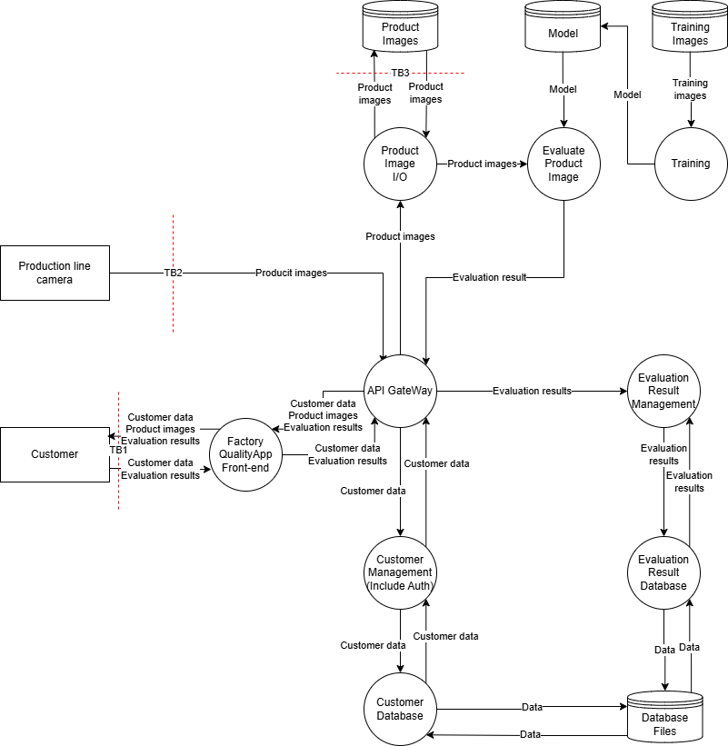
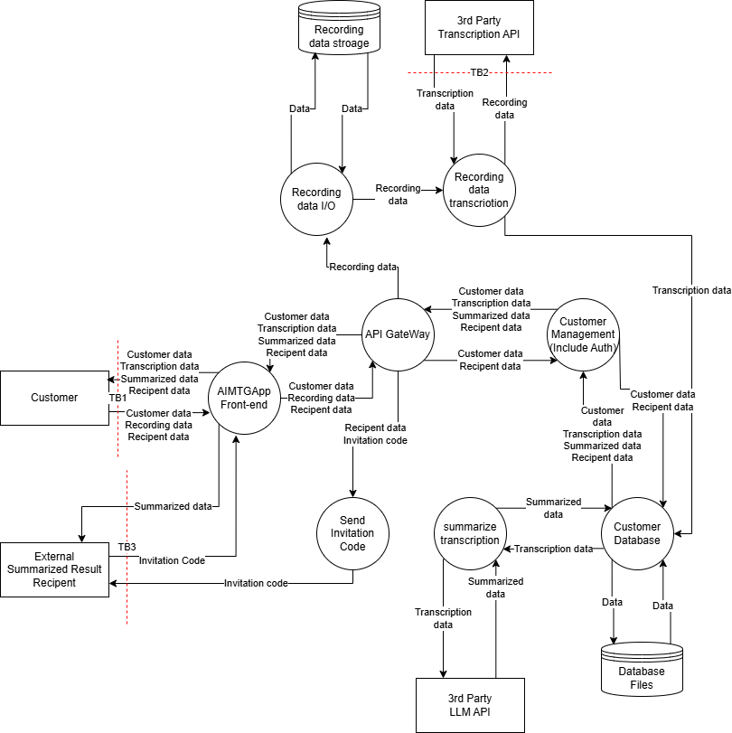
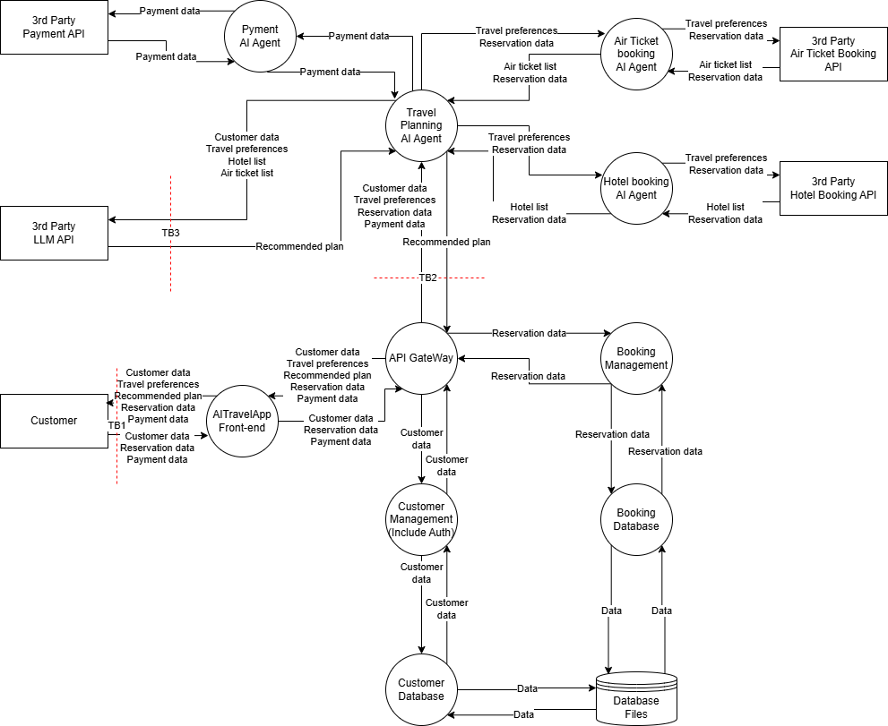

# STRIDE
## Application with Built-in AI Functionality
### Trust Boundaries

### STRIDE Table
#### TB1
| | Mitigation | Vulnerability |
| ---- | ---- | ---- |
| S | ID/password authentication | No multi-factor authentication |
| T | TLS, input validation | |
| R | | No logging function |
| I | | |
| D | | No rate limiting |
| E | Privilege control | |

#### TB2
| | Mitigation | Vulnerability |
| ---- | ---- | ---- |
| S | Token authentication | |
| T | TLS, input validation | |
| R | | No logging function |
| I | | Data is stored without encryption |
| D | | No rate limiting |
| E | Privilege control | |

#### TB3
| | Mitigation | Vulnerability |
| ---- | ---- | ---- |
| S | Token authentication | |
| T | TLS | |
| R | | No logging function |
| I | | Data is stored without encryption |
| D | Rate limiting | |
| E | Privilege control | |

### Risk Assessment and Threats
| ID | Vulnerability | Ease of Exploit | Awareness | Intrusion Detection | Technical Impact | Score | Risk | Mitigation |
| ---- | ---- | ---- | ---- | ---- | ---- | ---- | ---- | ---- |
| V1 | No multi-factor authentication for the customer | 2 | 3 | 3 | 2 | 5.3 | MID | Add multi-factor authentication for the customer |
| V2 | No audit log in the app | 1 | 2 | 2 | 1 | 1.7 | LOW | Add an audit log to the app |
| V3 | No rate limiting in the app | 2 | 3 | 3 | 2 | 5.3 | MID | Add rate limiting to the app |
| V4 | No log of the images sent from the camera | 1 | 2 | 2 | 1 | 1.7 | LOW | Add a transmission log to the camera |
| V5 | Images are stored on the camera without encryption | 2 | 2 | 2 | 3 | 6 | MID | Store images encrypted, define a retention period for images |
| V6 | No log of images being saved to storage | 1 | 2 | 2 | 1 | 1.7 | LOW | Add a log for when images are saved to storage |
| V7 | Images are stored in storage without encryption | 2 | 2 | 2 | 3 | 6 | MID | Store images encrypted |

LOW: <3, MID: 4<=6, HIGH: 7<=9

## Application Using an External LLM
### Trust Boundaries

### STRIDE Table
#### TB1
| | Mitigation | Vulnerability |
| ---- | ---- | ---- |
| S | ID/password authentication | No multi-factor authentication |
| T | TLS, input validation | |
| R | | No logging function |
| I | | |
| D | | No rate limiting |
| E | Privilege control | |

#### TB2
| | Mitigation | Vulnerability |
| ---- | ---- | ---- |
| S | Token authentication | |
| T | TLS | No input validation on the recording data. Note: it is difficult to judge whether the recording data contains confidential information. |
| R | Logging function | |
| I | | No output validation |
| D | Rate limiting | |
| E | Privilege control | |

#### TB3
| | Mitigation | Vulnerability |
| ---- | ---- | ---- |
| S | | Risk that the invitation code is guessed |
| T | TLS | |
| R | | No logging function |
| I | | Risk that a third party who has not been invited can view the summary content |
| D | | No rate limiting |
| E | | |

### Risk Assessment and Threats
| ID | Vulnerability | Ease of Exploit | Awareness | Intrusion Detection | Technical Impact | Score | Risk | Mitigation |
| ---- | ---- | ---- | ---- | ---- | ---- | ---- | ---- | ---- |
| V1 | No multi-factor authentication for the customer | 2 | 3 | 3 | 2 | 5.3 | MID | Add multi-factor authentication for the customer |
| V2 | No audit log in the app | 1 | 2 | 2 | 1 | 1.7 | LOW | Add an audit log to the app |
| V3 | No rate limiting in the app | 2 | 3 | 3 | 2 | 5.3 | MID | Add rate limiting to the app |
| V4 | No validation for confidential information in the recording data | 1 | 2 | 2 | 1 | 1.7 | LOW | Obtain consent regarding the handling of confidential information, confirm that there is no problem with the processing of data by the external API |
| V5 | No output validation in the summarization API | 2 | 2 | 2 | 2 | 4 | MID | Add output validation to the summarization API |
| V6 | There is a risk that the invitation code is guessed | 3 | 3 | 3 | 3 | 9 | HIGH | Discontinue the invitation code scheme and modify it so that only logged-in users can view the content |

LOW: <3, MID: 4<=6, HIGH: 7<=9

## Application Using Agentic AI
### Trust Boundaries

### STRIDE Table
#### TB1
| | Mitigation | Vulnerability |
| ---- | ---- | ---- |
| S | ID/password authentication | No multi-factor authentication |
| T | TLS, input validation | |
| R | | No logging function |
| I | | |
| D | | No rate limiting |
| E | Privilege control | |

#### TB2
| | Mitigation | Vulnerability |
| ---- | ---- | ---- |
| S | Token authentication | |
| T | TLS, input validation | |
| R | | No logging function |
| I | Output validation | |
| D | | No rate limiting |
| E | Privilege control | |

#### TB3
| | Mitigation | Vulnerability |
| ---- | ---- | ---- |
| S | Token authentication | |
| T | TLS, input validation | |
| R | Logging function | |
| I | | No output validation |
| D | Rate limiting | |
| E | Privilege control | |

### Risk Assessment and Threats
| ID | Vulnerability | Ease of Exploit | Awareness | Intrusion Detection | Technical Impact | Score | Risk | Mitigation |
| ---- | ---- | ---- | ---- | ---- | ---- | ---- | ---- | ---- |
| V1 | No multi-factor authentication for the customer | 2 | 3 | 3 | 2 | 5.3 | MID | Add multi-factor authentication for the customer |
| V2 | No audit log in the app | 1 | 2 | 2 | 1 | 1.7 | LOW | Add an audit log to the app |
| V3 | No rate limiting in the app | 2 | 3 | 3 | 2 | 5.3 | MID | Add rate limiting to the app |
| V4 | No log of the interactions with the AI Agent | 1 | 2 | 2 | 1 | 1.7 | LOW | Add a log of the AI Agent's interactions |
| V5 | No rate limiting for the AI Agent | 2 | 3 | 3 | 2 | 5.3 | MID | Add rate limiting to the AI Agent |
| V6 | No output validation for the LLM API | 2 | 2 | 2 | 3 | 6 | MID | Add output validation to the LLM API |

LOW: <3, MID: 4<=6, HIGH: 7<=9
