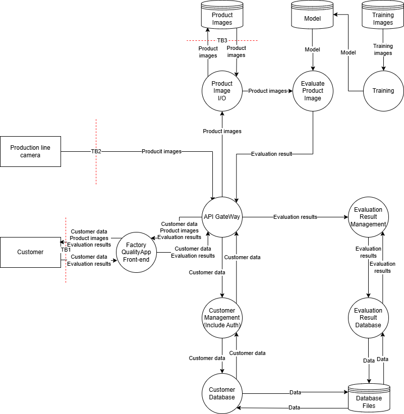
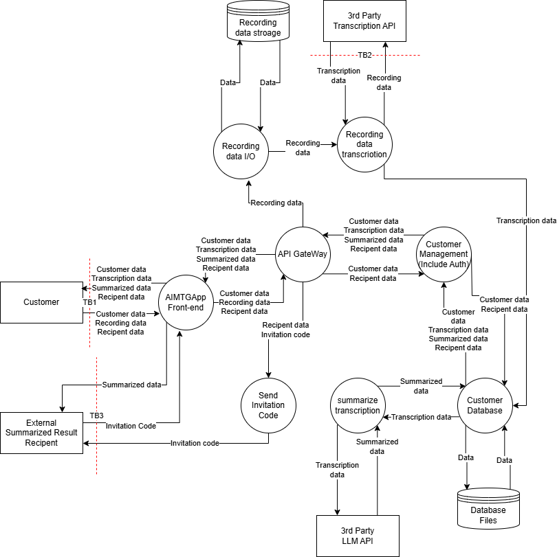
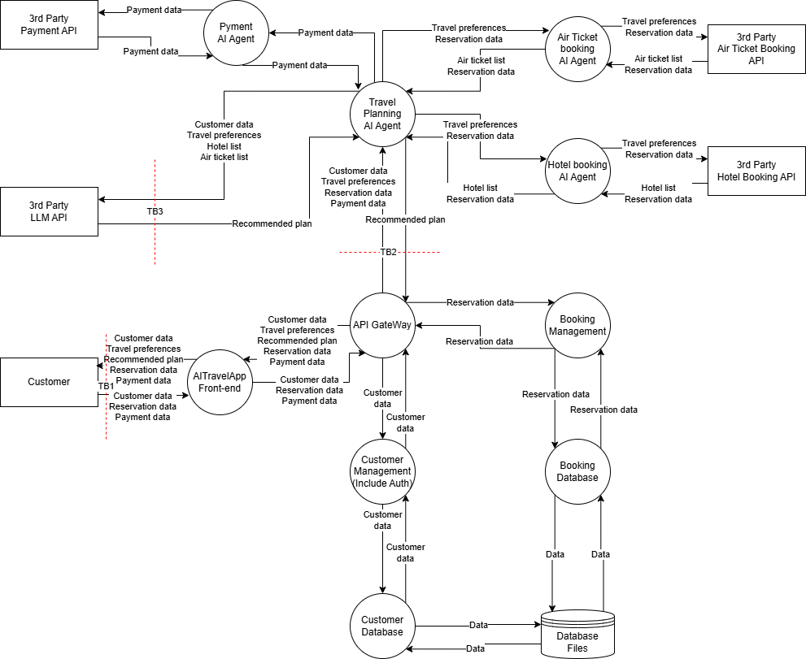

# STRIDE
## 内部にAI機能を有するアプリケーション
### 信頼境界

### STRIDEテーブル
#### TB1
| | 緩和策 | 脆弱性 |
| ---- | ---- | ---- |
| S | ID/パスワード認証 | 多要素認証がない |
| T | TLS, 入力値検証 | |
| R | | ログ機能がない |
| I | | |
| D | | レートリミットがない |
| E | 権限制御 | |

#### TB2
| | 緩和策 | 脆弱性 |
| ---- | ---- | ---- |
| S | トークン認証 | |
| T | TLS, 入力値検証 | |
| R | | ログ機能がない |
| I | | データが暗号化されずに保存されている |
| D | | レートリミットがない |
| E | 権限制御 | |

#### TB3
| | 緩和策 | 脆弱性 |
| ---- | ---- | ---- |
| S | トークン認証 | |
| T | TLS | |
| R | | ログ機能がない |
| I | | データが暗号化されずに保存されている |
| D | レートリミット | |
| E | 権限制御 | |

### リスクの評価と脅威
| ID | 脆弱性 | 悪用可能性 | 普及度 | 検知可能性 | 技術的影響 | スコア | リスク | 対策 |
| ---- | ---- | ---- | ---- | ---- | ---- | ---- | ---- | ---- |
| V1 | カスタマーに多要素認証がない | 2 | 3 | 3 | 2 | 5.3 | MID | カスタマーに多要素認証を追加する |
| V2 | アプリに監査ログがない | 1 | 2 | 2 | 1 | 1.7 | LOW | アプリに監査ログを追加する |
| V3 | アプリにレートリミットがない | 2 | 3 | 3 | 2 | 5.3 | MID | アプリにレートリミットを追加する |
| V4 | カメラに送信した画像のログがない | 1 | 2 | 2 | 1 | 1.7 | LOW | カメラに送信ログを追加する |
| V5 | カメラに画像が暗号化されずに保存されている | 2 | 2 | 2 | 3 | 6 | MID | 画像を暗号化して保存する, 画像の保管期間を定める |
| V6 | 画像をストレージに保存したログがない | 1 | 2 | 2 | 1 | 1.7 | LOW | ストレージに画像を保存する際のログを追加する |
| V7 | 画像が暗号化されずにストレージに保存されている | 2 | 2 | 2 | 3 | 6 | MID | 画像を暗号化して保存する |

LOW: <3, MID: 4<=6, HIGH: 7<=9

## 外部のLLMを用いたアプリケーション
### 信頼境界

### STRIDEテーブル
#### TB1
| | 緩和策 | 脆弱性 |
| ---- | ---- | ---- |
| S | ID/パスワード認証 | 多要素認証がない |
| T | TLS, 入力値検証 | |
| R | | ログ機能がない |
| I | | |
| D | | レートリミットがない |
| E | 権限制御 | |

#### TB2
| | 緩和策 | 脆弱性 |
| ---- | ---- | ---- |
| S | トークン認証 | |
| T | TLS | 録音データに入力値検証がない。※録音データに機密情報が含まれているかどうかを判断することは困難。 |
| R | ログ機能 | |
| I | | 出力値検証がない |
| D | レートリミット | |
| E | 権限制御 | |

#### TB3
| | 緩和策 | 脆弱性 |
| ---- | ---- | ---- |
| S | | 招待コードが推測される恐れ |
| T | TLS | |
| R | | ログ機能がない |
| I | | 招待されてない第三者が要約内容を閲覧できる恐れ |
| D | | レートリミットがない |
| E | | |

### リスクの評価と脅威
| ID | 脆弱性 | 悪用可能性 | 普及度 | 検知可能性 | 技術的影響 | スコア | リスク | 対策 |
| ---- | ---- | ---- | ---- | ---- | ---- | ---- | ---- | ---- |
| V1 | カスタマーに多要素認証がない | 2 | 3 | 3 | 2 | 5.3 | MID | カスタマーに多要素認証を追加する |
| V2 | アプリに監査ログがない | 1 | 2 | 2 | 1 | 1.7 | LOW | アプリに監査ログを追加する |
| V3 | アプリにレートリミットがない | 2 | 3 | 3 | 2 | 5.3 | MID | アプリにレートリミットを追加する |
| V4 | 録音データに対する機密情報のバリデーションがない | 1 | 2 | 2 | 1 | 1.7 | LOW | 機密情報の取り扱いに関する同意を取得する, 外部APIによるデータ処理に問題がないことを確認する |
| V5 | 要約APIに出力値検証がない | 2 | 2 | 2 | 2 | 4 | MID | 要約APIに出力値検証を追加する |
| V6 | 招待コードが推測される恐れがある | 3 | 3 | 3 | 3 | 9 | HIGH | 招待コード方式をやめ、ログイン後のユーザのみが閲覧できるように修正する |

LOW: <3, MID: 4<=6, HIGH: 7<=9

## エージェント型AIを用いたアプリケーション
### 信頼境界

### STRIDEテーブル
#### TB1
| | 緩和策 | 脆弱性 |
| ---- | ---- | ---- |
| S | ID/パスワード認証 | 多要素認証がない |
| T | TLS, 入力値検証 | |
| R | | ログ機能がない |
| I | | |
| D | | レートリミットがない |
| E | 権限制御 | |

#### TB2
| | 緩和策 | 脆弱性 |
| ---- | ---- | ---- |
| S | トークン認証 | |
| T | TLS, 入力値検証 | |
| R | | ログ機能がない |
| I | 出力値検証 | |
| D | | レートリミットがない |
| E | 権限制御 | |

#### TB3
| | 緩和策 | 脆弱性 |
| ---- | ---- | ---- |
| S | トークン認証 | |
| T | TLS, 入力値検証 | |
| R | ログ機能 | |
| I | | 出力値検証がない |
| D | レートリミット | |
| E | 権限制御 | |

### リスクの評価と脅威
| ID | 脆弱性 | 悪用可能性 | 普及度 | 検知可能性 | 技術的影響 | スコア | リスク | 対策 |
| ---- | ---- | ---- | ---- | ---- | ---- | ---- | ---- | ---- |
| V1 | カスタマーに多要素認証がない | 2 | 3 | 3 | 2 | 5.3 | MID | カスタマーに多要素認証を追加する |
| V2 | アプリに監査ログがない | 1 | 2 | 2 | 1 | 1.7 | LOW | アプリに監査ログを追加する |
| V3 | アプリにレートリミットがない | 2 | 3 | 3 | 2 | 5.3 | MID | アプリにレートリミットを追加する |
| V4 | AI Agentとのやり取りのログがない | 1 | 2 | 2 | 1 | 1.7 | LOW | AI Agentのやり取りのログを追加する |
| V5 | AI Agentのレートリミットがない | 2 | 3 | 3 | 2 | 5.3 | MID | AI Agentにレートリミットを追加する |
| V6 | LLM APIの出力値検証がない | 2 | 2 | 2 | 3 | 6 | MID | LLM APIに出力値検証を追加する |

LOW: <3, MID: 4<=6, HIGH: 7<=9