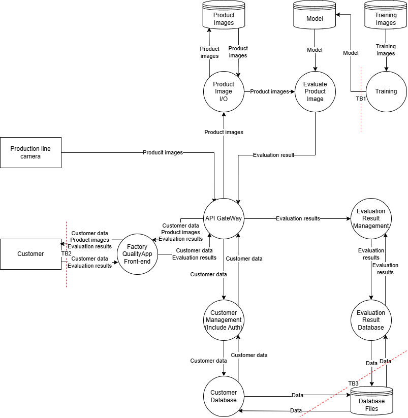
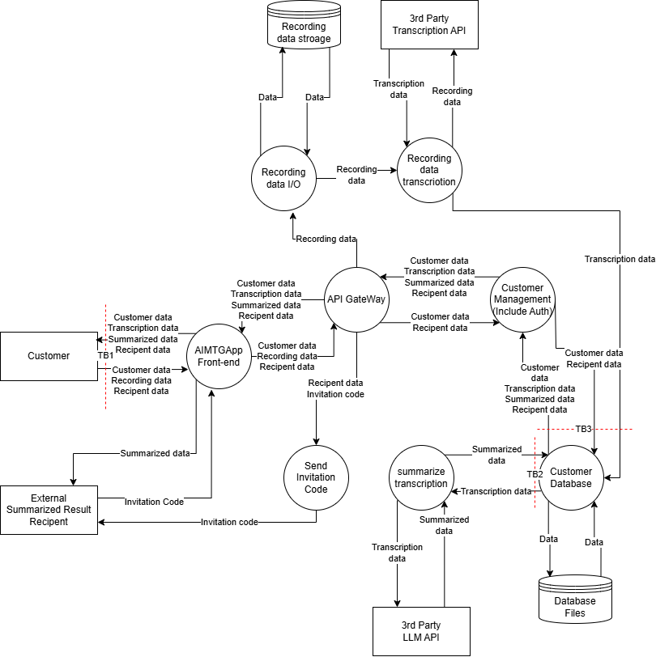
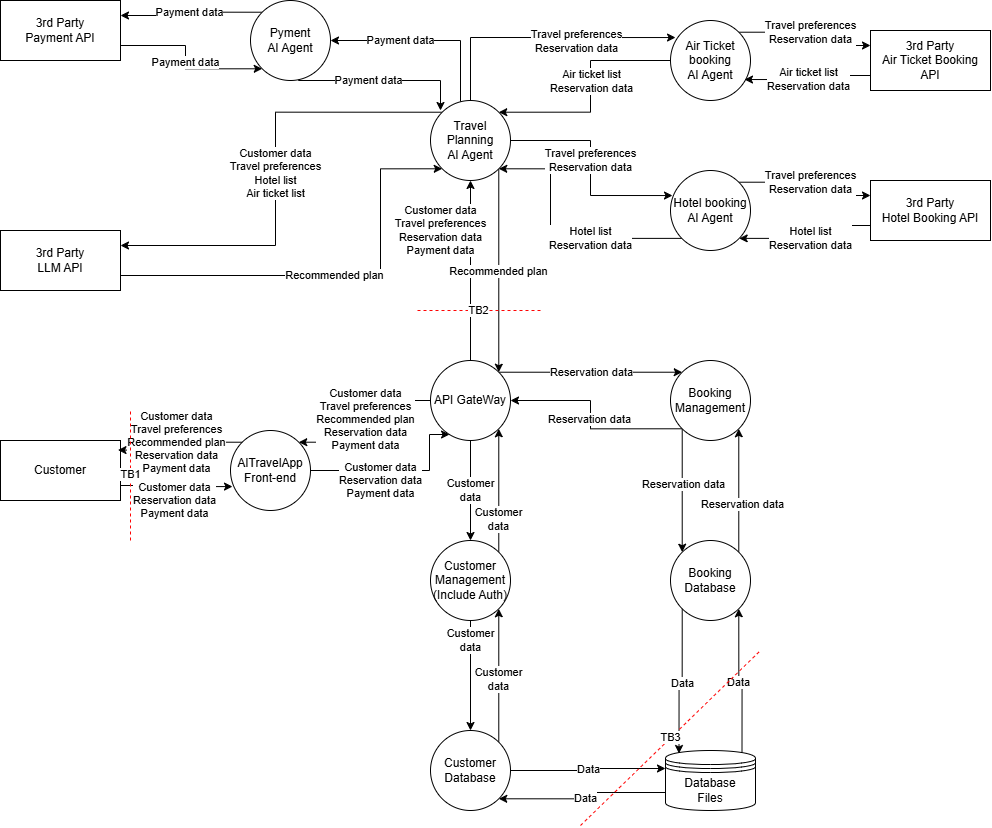

# STRIDE
## Application with Built-in AI Functionality
### Trust Boundaries

### STRIDE Table
#### TB1
| TB1 | Mitigation | Vulnerability |
| --- | --- | --- |
|S|Service authentication for training jobs/CI|An unauthorized trainer/CI can impersonate a legitimate job and register a model (note: this assumes that an administrator issues the Training job. Not shown in the DFD.)|
|T|Signature verification at registration/use time using the model signature, encryption of the communication path|Files are tampered with during network transfer or while held in storage.|
|R|Audit logs, assignment of correlation IDs|The audit trail for model updates is thin, so at incident time it is impossible to trace "who updated it" / the action is repudiated|
|I|Least privilege for the model repository, encryption of the communication path|The model can be obtained illicitly (leakage of intellectual property, a foothold for model extraction)|
|D|Job queue for training/registration, rate limiting, resource caps|The model update process can be stopped, for example by issuing a large number of jobs|
|E|Separation of privileges among the training environment, the model repository, and the inference environment|If the training environment is compromised, an attacker can move laterally as far as the model repository/inference side and tamper with them with high privileges|

#### TB2
| TB2 | Mitigation | Vulnerability |
| --- | --- | --- |
|S|Introduction of MFA, strengthening of the password policy, introduction of account lockout and session management functions|An attacker can impersonate a customer and log in (credential theft/brute force). Session fixation and token theft succeed.|
|T|Encryption of communication data, appropriate parameter validation|Request parameters are tampered with in transit or via the browser, and tampering with the ID used to view results or an unauthorized request succeeds.|
|R|Audit logs, assignment of correlation IDs|It cannot be traced who viewed/downloaded results and when, and the actor can repudiate the operation.|
|I|Masking of screens/logs, cache control, access control (object level), suppression of error messages, DLP|Recognition results and product images leak due to insufficient privileges or through the screen cache/logs. Other users' results can be viewed via IDOR and the like.|
|D|Rate limiting, introduction of a WAF, an upper limit on upload size|A large volume of access or the upload of huge images overloads the front end/API, making it impossible to view results.|
|E|Access privilege control, authorization control, separation of the administration screen, CSP/clickjacking countermeasures, XSS countermeasures|Through XSS or inadequate privilege checks, a general user can perform administrator-equivalent operations or access other users' assets.|

#### TB3
| TB3 | Mitigation | Vulnerability |
| --- | --- | --- |
|S|Service-to-service authentication, IAM-based DB connections, network access restrictions|An attacker can impersonate an internal service and connect to the DB (lack of service-to-service authentication / shared accounts)|
|T|Minimization of DB privileges, integrity constraints on critical tables, tamper detection|Judgment results and customer data are illicitly rewritten or deleted.|
|R|DB audit logs, assignment of correlation IDs|Reads/updates cannot be traced, and data operations are repudiated|
|I|Encryption of stored data and the communication path, data masking|Customer information and past quality judgment data are illicitly read from the database.|
|D|Appropriate query timeout settings, access rate limiting|A large number of connections or high-load queries exhaust DB resources, stopping the functions for registering and viewing results|
|E|Access privilege control, authorization control|Through seizure of DB administrator privileges or misconfiguration, a general service can perform administrator-equivalent operations|

### Risk Assessment and Threats
| ID | Vulnerability | Ease of Exploit | Awareness | Intrusion Detection | Technical Impact | Score | Risk | Mitigation |
| --- | --- | --- | --- | --- | --- | --- | --- | --- |
|V1|An unauthorized trainer/CI can impersonate a legitimate job and register a model|2|2|2|2|4|MID|Service authentication for training jobs/CI|
|V2|Files are tampered with during network transfer or while held in storage.|2|2|2|3|6|MID|Signature verification at registration/use time using the model signature, encryption of the communication path|
|V3|The audit trail for model updates is thin, so at incident time it is impossible to trace "who updated it" / the action is repudiated|1|2|2|2|3.3|MID|Audit logs, assignment of correlation IDs|
|V4|The model can be obtained illicitly (leakage of intellectual property, a foothold for model extraction)|2|2|2|2|4|MID|Least privilege for the model repository, encryption of the communication path|
|V5|The model update process can be stopped, for example by issuing a large number of jobs|2|2|2|2|4|MID|Job queue for training/registration, rate limiting, resource caps|
|V6|If the training environment is compromised, an attacker can move laterally as far as the model repository/inference side and tamper with them with high privileges|2|2|2|3|6|MID|Separation of privileges among the training environment, the model repository, and the inference environment|
|V7|An attacker can impersonate a customer and log in (credential theft/brute force). Session fixation and token theft succeed.|3|2|2|2|4.7|MID|MFA, lockout, session regeneration, shortening of token lifetimes, detection of anomalous logins|
|V8|Request parameters are tampered with in transit or via the browser, and tampering with the ID used to view results or an unauthorized request succeeds.|2|2|2|2|4|MID|Encryption of communication data, appropriate parameter validation|
|V9|It cannot be traced who viewed/downloaded results and when, and the actor can repudiate the operation.|1|2|2|2|3.3|MID|Audit logs, assignment of correlation IDs|
|V10|Recognition results and product images leak due to insufficient privileges or through the screen cache/logs. Other users' results can be viewed via IDOR and the like.|2|2|2|2|4|MID|Masking of screens/logs, cache control, access control (object level), suppression of error messages, DLP|
|V11|A large volume of access or the upload of huge images overloads the front end/API, making it impossible to view results.|2|2|2|2|4|MID|Rate limiting, introduction of a WAF, an upper limit on upload size|
|V12|Through XSS or inadequate privilege checks, a general user can perform administrator-equivalent operations or access other users' assets.|2|2|2|3|6|MID|Access privilege control, authorization control, separation of the administration screen, CSP/clickjacking countermeasures, XSS countermeasures|
|V13|An attacker can impersonate an internal service and connect to the DB (lack of service-to-service authentication / shared accounts)|2|2|2|3|6|MID|Service-to-service authentication, IAM-based DB connections, network access restrictions|
|V14|Rewriting/deletion of identification results or customer data cannot be detected, or excessive privileges make tampering easy|2|2|2|3|6|MID|Minimization of DB privileges, integrity constraints on critical tables, tamper detection|
|V15|Reads/updates cannot be traced, and data operations are repudiated|1|2|2|2|3.3|MID|DB audit logs, assignment of correlation IDs|
|V16|Customer information and past quality judgment data are illicitly read from the database.|2|2|2|3|6|MID|Encryption of stored data and the communication path, data masking|
|V17|A large number of connections or high-load queries exhaust DB resources, stopping the functions for registering and viewing results|2|2|2|2|4|MID|Appropriate query timeout settings, access rate limiting|
|V18|Through seizure of DB administrator privileges or misconfiguration, a general service can perform administrator-equivalent operations|2|2|2|3|6|MID|Access privilege control, authorization control|

## Application Using an External LLM
### Trust Boundaries

### STRIDE Table
#### TB1
| TB1 | Mitigation | Vulnerability |
| --- | --- | --- |
|S|Introduction of multi-factor authentication (MFA), shortening of session lifetimes, device- and behavior-based anomaly detection|An attacker takes over a customer's account and gains unauthorized access to another person's recording data and summarization results.|
|T|Encryption of communications, CSRF countermeasures, validation of the format and size of uploaded files|Requests are tampered with, and the sharing recipient or the summary ID is illicitly changed.|
|R|Collection of audit logs for critical operations such as sharing and downloading, tamper-resistant log management|The trail of who shared or viewed a summary cannot be followed, and unauthorized operations are repudiated.|
|I|Object-level authorization control, masking of screens and logs|Due to inadequate access control (IDOR and the like), invitation codes and summarization results leak to third parties.|
|D|Rate limiting, setting an upper limit on upload size, introduction of a WAF|A large volume of access or the upload of huge files overloads the web front end and stops it.|
|E|Access privilege control, secure coding such as XSS countermeasures|An application vulnerability (such as XSS) is exploited, and a general user seizes administrative privileges or accesses another person's data.|

#### TB2
| TB2 | Mitigation | Vulnerability |
| --- | --- | --- |
|S|Secure storage of external API keys, restriction of source IP addresses and introduction of mTLS|An API key is stolen by an attacker, and the external API is used illicitly within the company's own contracted quota. Alternatively, an attacker impersonates the external API and returns false responses.|
|T|Encryption of communications, verification of responses by means of request signing|Tampering on the communication path rewrites request and response data.|
|R|Collection of basic communication logs for the external API|When a communication error or failure occurs, it cannot be traced whether the problem lay on the system side or on the external API side.|
|I|Encryption of communications, minimization of transmitted data by masking personal information|Interception of communications leaks meeting audio and text data to third parties.|
|D|Appropriate timeout settings, retry control, introduction of a circuit breaker|The system is caught up in delays or failures on the external API side, and the transcription and summarization functions stop.|
|E|Minimization of API invocation privileges|Due to inadequate privilege settings, the API execution privilege is misused from other internal services.|

#### TB3
| TB3 | Mitigation | Vulnerability |
| --- | --- | --- |
|S|Access authentication between internal services, network isolation of database connections|An attacker impersonates a legitimate internal service, connects to the database, and performs unauthorized operations.|
|T|Minimization of database privileges, introduction of audit tables, data integrity constraints, regular backups and restore tests|Meeting recordings, transcription text, summarization results, and sharing recipient information stored in the database are illicitly rewritten or deleted.|
|R|Collection of logs of all operations against the database, storage of logs in tamper-proof storage|Direct operations against the database cannot be traced, making it impossible to identify who viewed or modified highly confidential summary data.|
|I|Encryption of stored data and the communication path, column-level masking, introduction of DLP, protection of backup data|Highly confidential meeting recording data and transcription text are illicitly read in bulk from the database or backup files, resulting in an information leak.|
|D|Limits on query execution time, an upper limit on the number of concurrent connections, appropriate index design and resource monitoring|Deliberately high-load queries are executed or a large number of connection requests are generated, stopping the database and making the entire application's functionality unavailable.|
|E|Strict role-based access control, separation of the administration network, secure management of DB credentials|Inadequate privilege settings and the like are exploited, a general service or an attacker seizes database administrator privileges, and a state is reached in which all data can be freely viewed and manipulated.|

### Risk Assessment and Threats
| ID | Vulnerability | Ease of Exploit | Awareness | Intrusion Detection | Technical Impact | Score | Risk | Mitigation |
| --- | --- | --- | --- | --- | --- | --- | --- | --- |
|V1|An attacker takes over a customer's account and gains unauthorized access to another person's recording data and summarization results.|3|2|2|3|7|HIGH|Introduction of multi-factor authentication (MFA), shortening of session lifetimes, device- and behavior-based anomaly detection|
|V2|Requests are tampered with, and the sharing recipient or the summary ID is illicitly changed.|2|2|2|3|6|MID|Encryption of communications, CSRF countermeasures, validation of the format and size of uploaded files|
|V3|The trail of who shared or viewed a summary cannot be followed, and unauthorized operations are repudiated.|1|2|2|2|3.3|MID|Collection of audit logs for critical operations such as sharing and downloading, tamper-resistant log management|
|V4|Due to inadequate access control (IDOR and the like), invitation codes and summarization results leak to third parties.|2|2|2|3|6|MID|Object-level authorization control, masking of screens and logs|
|V5|A large volume of access or the upload of huge files overloads the web front end and stops it.|2|2|2|2|4|MID|Rate limiting, setting an upper limit on upload size, introduction of a WAF|
|V6|An application vulnerability (such as XSS) is exploited, and a general user seizes administrative privileges or accesses another person's data.|2|2|2|3|6|MID|Access privilege control, secure coding such as XSS countermeasures|
|V7|An API key is stolen by an attacker, and the external API is used illicitly within the company's own contracted quota. Alternatively, an attacker impersonates the external API and returns false responses.|2|2|2|3|6|MID|Secure storage of external API keys, restriction of source IP addresses and introduction of mTLS|
|V8|Tampering on the communication path rewrites request and response data.|2|2|2|3|6|MID|Encryption of communications, verification of responses by means of request signing|
|V9|When a communication error or failure occurs, it cannot be traced whether the problem lay on the system side or on the external API side.|1|2|2|2|3.3|MID|Collection of basic communication logs for the external API|
|V10|Interception of communications leaks meeting audio and text data to third parties.|2|3|2|3|7|HIGH|Encryption of communications, minimization of transmitted data by masking personal information|
|V11|The system is caught up in delays or failures on the external API side, and the transcription and summarization functions stop.|2|2|2|2|4|MID|Appropriate timeout settings, retry control, introduction of a circuit breaker|
|V12|Due to inadequate privilege settings, the API execution privilege is misused from other internal services.|2|2|2|3|6|MID|Minimization of API invocation privileges|
|V13|An attacker impersonates a legitimate internal service, connects to the database, and performs unauthorized operations.|2|2|2|3|6|MID|Access authentication between internal services, network isolation of database connections|
|V14|Meeting recordings, transcription text, summarization results, and sharing recipient information stored in the database are illicitly rewritten or deleted.|2|2|2|3|6|MID|Minimization of database privileges, introduction of audit tables, data integrity constraints, regular backups and restore tests|
|V15|Direct operations against the database cannot be traced, making it impossible to identify who viewed or modified highly confidential summary data.|1|2|2|2|3.3|MID|Collection of logs of all operations against the database, storage of logs in tamper-proof storage|
|V16|Highly confidential meeting recording data and transcription text are illicitly read in bulk from the database or backup files, resulting in an information leak.|2|2|2|3|6|MID|Encryption of stored data and the communication path, column-level masking, introduction of DLP, protection of backup data|
|V17|Deliberately high-load queries are executed or a large number of connection requests are generated, stopping the database and making the entire application's functionality unavailable.|2|2|2|2|4|MID|Limits on query execution time, an upper limit on the number of concurrent connections, appropriate index design and resource monitoring|
|V18|Inadequate privilege settings and the like are exploited, a general service or an attacker seizes database administrator privileges, and a state is reached in which all data can be freely viewed and manipulated.|2|2|2|3|6|MID|Strict role-based access control, separation of the administration network, secure management of DB credentials|

## Application Using Agentic AI
### Trust Boundaries

### STRIDE Table
#### TB1
| TB1 | Mitigation | Vulnerability |
| --- | --- | --- |
|S|Introduction of multi-factor authentication (MFA), shortening of session token lifetimes, anomaly detection at login|An attacker takes over a customer's account and gains unauthorized access to another person's travel preferences and reservation/payment information.|
|T|Encryption of communications, CSRF countermeasures, strict validation of input parameters (such as reservation dates and amounts)|Requests are tampered with, and another person's reservation ID or the amount is illicitly changed.|
|R|Audit logs, tamper-resistant log management|The actor behind a reservation or payment operation cannot be identified, and unauthorized operations are repudiated.|
|I|Object-level authorization control, masking of screens and logs|Due to inadequate access privilege settings and the like, another person's customer data and payment information leak.|
|D|Rate limiting, setting an upper limit on input size, introduction of a WAF|A large volume of access puts the web front end into an overloaded state, making reservation operations impossible.|
|E|Strict access privilege control, separation of administrative functions, secure coding such as XSS countermeasures|An application vulnerability (such as XSS) is exploited, and a general user escalates privileges and ends up viewing, cancelling, or paying for another person's reservation.|

#### TB2
| TB2 | Mitigation | Vulnerability |
| --- | --- | --- |
|S|Mutual authentication between internal services, strict management of agent identifiers|A compromised internal system or another service impersonates a legitimate AI agent that holds the privilege to execute payments and reservations, and performs unauthorized processing.|
|T|Encryption and signature verification of internal communications, strict validation of parameter types and ranges in API integration|The parameters for reservation details and payment amounts are tampered with on the communication path.|
|R|Collection of standard audit logs for API calls between services, assignment of correlation IDs|When an error or a fraudulent reservation occurs, it is not technically possible to trace in which inter-system communication the problem arose.|
|I|Encryption of the communication path, prevention of confidential information being written to logs and masking measures|Interception of communications or inappropriate management of logs leaks customers' travel preferences and personal information inside the system.|
|D|Appropriate timeout settings, rate limiting of inter-system communication, introduction of a circuit breaker|A large volume of communication from other services overloads the API Gateway and the back end, delaying or stopping reservation processing.|
|E|The principle of least privilege in service-to-service communication (authorization control for API access)|Due to inadequate privilege settings, a low-privilege internal service ends up calling the reservation confirmation and payment APIs directly.|

#### TB3
| TB3 | Mitigation | Vulnerability |
| --- | --- | --- |
|S|Strong authentication for database connections, network isolation, access authentication between internal services|An attacker uses a compromised internal service as a stepping stone to impersonate a legitimate service, connects to the database, and illicitly obtains all the data.|
|T|Minimization of database privileges, introduction of audit tables, data integrity constraints|Customers' travel reservation data and payment status stored in the database are illicitly rewritten or deleted.|
|R|Audit logs, assignment of correlation IDs across the entire system|The trail of direct data operations against the database cannot be followed, making it impossible to identify (prove) who tampered with reservation data or when a defect in the payment integration occurred.|
|I|Encryption of stored data and the communication path, masking of critical data, introduction of DLP|Customers' highly confidential travel preferences, payment information such as credit cards, and detailed reservation information are illicitly read in bulk from the database or backup files, resulting in an information leak.|
|D|An upper limit on the number of concurrent connections, limits on query execution time, performance monitoring and a failover configuration for anomalies|Deliberately high-load queries are executed or a large number of connection requests are generated, putting the database into a locked state and stopping the entire reservation management system.|
|E|Access control based on the principle of least privilege, separation of the administration network|Inadequate privilege settings and the like are exploited, a general service or an attacker seizes database administrator privileges, and a state is reached in which fatal operations such as cancelling all reservations or viewing all customer information can be freely executed.|

### Risk Assessment and Threats
| ID | Vulnerability | Ease of Exploit | Awareness | Intrusion Detection | Technical Impact | Score | Risk | Mitigation |
| --- | --- | --- | --- | --- | --- | --- | --- | --- |
|V1|An attacker takes over a customer's account and gains unauthorized access to another person's travel preferences and reservation/payment information.|3|2|2|3|7|HIGH|Introduction of multi-factor authentication (MFA), shortening of session token lifetimes, anomaly detection at login|
|V2|Requests are tampered with, and another person's reservation ID or the amount is illicitly changed.|2|2|2|3|6|MID|Encryption of communications, CSRF countermeasures, strict validation of input parameters (such as reservation dates and amounts)|
|V3|The actor behind a reservation or payment operation cannot be identified, and unauthorized operations are repudiated.|1|2|2|2|3.3|MID|Audit logs, tamper-resistant log management|
|V4|Due to inadequate access privilege settings and the like, another person's customer data and payment information leak.|2|2|2|3|6|MID|Object-level authorization control, masking of screens and logs|
|V5|A large volume of access puts the web front end into an overloaded state, making reservation operations impossible.|2|2|2|2|4|MID|Rate limiting, setting an upper limit on input size, introduction of a WAF|
|V6|An application vulnerability (such as XSS) is exploited, and a general user escalates privileges and ends up viewing, cancelling, or paying for another person's reservation.|2|2|2|3|6|MID|Strict access privilege control, separation of administrative functions, secure coding such as XSS countermeasures|
|V7|A compromised internal system or another service impersonates a legitimate AI agent that holds the privilege to execute payments and reservations, and performs unauthorized processing.|2|2|2|3|6|MID|Mutual authentication between internal services, strict management of agent identifiers|
|V8|The parameters for reservation details and payment amounts are tampered with on the communication path.|2|2|2|3|6|MID|Encryption and signature verification of internal communications, strict validation of parameter types and ranges in API integration|
|V9|When an error or a fraudulent reservation occurs, it is not technically possible to trace in which inter-system communication the problem arose.|1|2|2|2|3.3|MID|Collection of standard audit logs for API calls between services, assignment of correlation IDs|
|V10|Interception of communications or inappropriate management of logs leaks customers' travel preferences and personal information inside the system.|2|2|2|3|6|MID|Encryption of the communication path, prevention of confidential information being written to logs and masking measures|
|V11|A large volume of communication from other services overloads the API Gateway and the back end, delaying or stopping reservation processing.|2|2|2|2|4|MID|Appropriate timeout settings, rate limiting of inter-system communication, introduction of a circuit breaker|
|V12|Due to inadequate privilege settings, a low-privilege internal service ends up calling the reservation confirmation and payment APIs directly.|2|2|2|3|6|MID|The principle of least privilege in service-to-service communication (authorization control for API access)|
|V13|An attacker uses a compromised internal service as a stepping stone to impersonate a legitimate service, connects to the database, and illicitly obtains all the data.|2|2|2|3|6|MID|Strong authentication for database connections, network isolation, access authentication between internal services|
|V14|Customers' travel reservation data and payment status stored in the database are illicitly rewritten or deleted.|2|2|2|3|6|MID|Minimization of database privileges, introduction of audit tables, data integrity constraints|
|V15|The trail of direct data operations against the database cannot be followed, making it impossible to identify (prove) who tampered with reservation data or when a defect in the payment integration occurred.|1|2|2|2|3.3|MID|Audit logs, assignment of correlation IDs across the entire system|
|V16|Customers' highly confidential travel preferences, payment information such as credit cards, and detailed reservation information are illicitly read in bulk from the database or backup files, resulting in an information leak.|2|2|2|3|6|MID|Encryption of stored data and the communication path, masking of critical data, introduction of DLP|
|V17|Deliberately high-load queries are executed or a large number of connection requests are generated, putting the database into a locked state and stopping the entire reservation management system.|2|2|2|2|4|MID|An upper limit on the number of concurrent connections, limits on query execution time, performance monitoring and a failover configuration for anomalies|
|V18|Inadequate privilege settings and the like are exploited, a general service or an attacker seizes database administrator privileges, and a state is reached in which fatal operations such as cancelling all reservations or viewing all customer information can be freely executed.|2|2|2|3|6|MID|Access control based on the principle of least privilege, separation of the administration network|
